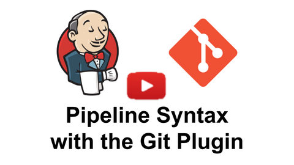

[[git-plugin]]
= Git Plugin
:toc: macro
:toc-title:

link:https://ci.jenkins.io/job/Plugins/job/git-plugin/job/master/[image:https://ci.jenkins.io/job/Plugins/job/git-plugin/job/master/badge/icon[Build]]
link:https://github.com/jenkinsci/git-plugin/graphs/contributors[image:https://img.shields.io/github/contributors/jenkinsci/git-plugin.svg?color=blue[Contributors]]
link:https://plugins.jenkins.io/git[image:https://img.shields.io/jenkins/plugin/i/git.svg?color=blue&label=installations[Jenkins Plugin Installs]]
link:https://github.com/jenkinsci/git-plugin/releases/latest[image:https://img.shields.io/github/release/jenkinsci/git-plugin.svg?label=changelog[GitHub release]]
link:https://gitter.im/jenkinsci/git-plugin[image:https://badges.gitter.im/jenkinsci/git-plugin.svg[Gitter]]

[#introduction]
== Introduction

[.float-group]
--
[.text-center]
image:https://jenkins.io/images/logos/jenkins/jenkins.png[Jenkins logo,height=192,role=center,float=right]

image:https://git-scm.com/images/logos/downloads/Git-Logo-2Color.png[Git logo,height=128,float=right]
--

The git plugin provides fundamental git operations for Jenkins projects.
It can poll, fetch, checkout, branch, list, merge, tag, and push repositories.

toc::[]

[#changelog]
== Changelog in https://github.com/jenkinsci/git-plugin/releases[GitHub Releases]

Release notes are recorded in https://github.com/jenkinsci/git-plugin/releases[GitHub Releases] since July 1, 2019 (git plugin 3.10.1 and later).
Prior release notes are recorded in the git plugin repository link:CHANGELOG.adoc#changelog-moved-to-github-releases[change log].

== Pipelines

The git plugin provides an SCM implementation to be used with the Pipeline SCM link:https://www.jenkins.io/doc/pipeline/steps/workflow-scm-step/[`checkout` step].
The "Pipeline Syntax" helper guides the user to select checkout options.
The 90 second video clip linked below introduces the Pipeline Syntax helper and shows how it is used to generate statements for the Jenkins Pipeline.

////

=== Organization Folders and Multibranch Pipelines

The git plugin also includes a multibranch provider for Jenkins link:https://www.jenkins.io/doc/book/pipeline/multibranch/[Multibranch Pipelines] and for Jenkins link:https://www.jenkins.io/doc/book/pipeline/multibranch/#organization-folders[Organization Folders].

The 5 minute video clip below introduces Multibranch Pipelines and Organization Folders.

image:https://img.youtube.com/vi/ai1kf4ihZUo/maxresdefault.jpg[link=https://youtu.be/ai1kf4ihZUo]

////

[#configuration]
== [[GitPlugin-ProjectConfiguration]]Configuration

[#using-repositories]
=== Repositories

image:/images/git-repository-configuration.png[Repository Configuration]

The git plugin fetches commits from one or more remote repositories and performs a checkout in the agent workspace.
Repositories and their related information include:

Repository URL::

  The URL of the remote repository.
  The git plugin passes the remote repository URL to the git implementation (command line or JGit).
  Valid repository URL's include `https`, `ssh`, `scp`, `git`, `local file`, and other forms.
  Valid repository URL forms are described in the link:https://git-scm.com/book/en/v2/Git-on-the-Server-The-Protocols#_the_protocols[git documentation].

Credentials::

  Credentials are defined using the link:https://plugins.jenkins.io/credentials[Jenkins credentials plugin].
  They are selected from a drop-down list and their identifier is stored in the job definition.
  Refer to <<using-credentials,using credentials>> for more details on supported credential types.

Name::

  Git uses a shortname to simplify user references to the URL of the remote repository.
  The default shortname is `origin`.
  Other values may be assigned and then used throughout the job definition to refer to the remote repository.

Refspec::

  A refspec maps remote branches to local references.
  It defines the branches and tags which will be fetched from the remote repository into the agent workspace.
+
A refspec defines the remote references that will be retrieved and how they map to local references.
If left blank, it will default to the normal `git fetch` behavior and will retrieve all branches.
This default behavior is sufficient for most cases.
+
The default refspec is `+refs/heads/*:refs/remotes/REPOSITORYNAME/` where REPOSITORYNAME is the value you specify in the above repository "Name" field.
The default refspec retrieves all branches.
If a checkout only needs one branch, then a more restrictive refspec can reduce the data transfer from the remote repository to the agent workspace.
For example, `+refs/heads/master:refs/remotes/origin/master` will retrieve only the master branch and nothing else.
+
The refspec can be used with the <<honor-refspec-on-initial-clone,honor refspec on initial clone>> option in the <<advanced-clone-behaviours,advanced clone behaviors>> to limit the number of remote branches mapped to local references.
If "honor refspec on initial clone" is not enabled, then a default refspec for its initial fetch.
This maintains compatibility with previous behavior and allows the job definition to decide if the refspec should be honored on initial clone.
+
Multiple refspecs can be entered by separating them with a space character.
The refspec value `+refs/heads/master:refs/remotes/origin/master +refs/heads/develop:refs/remotes/origin/develop` retrieves the master branch and the develop branch and nothing else.
+
Refer to the link:https://git-scm.com/book/en/v2/Git-Internals-The-Refspec[git refspec documentation] for more refspec details.

[#using-credentials]
=== Using Credentials

The git plugin supports username / password credentials and private key credentials provided by the
https://plugins.jenkins.io/credentials[Jenkins credentials plugin].
It does not support other credential types like secret text, secret file, or certificates.
Select credentials from the job definition drop down menu or enter their identifiers in Pipeline job definitions.

[#push-notification-from-repository]
=== [[GitPlugin-Pushnotificationfromrepository]]Push Notification From Repository

To minimize the delay between a push and a build, configure the remote repository to use a Webhook to notify Jenkins of changs to the repository.
Refer to webhook documentation for your repository:

* link:https://plugins.jenkins.io/github#GitHubPlugin-GitHubhooktriggerforGITScmpolling[GitHub]
* link:https://plugins.jenkins.io/bitbucket[Bitbucket]
* link:https://plugins.jenkins.io/gitlab-branch-source[GitLab]
* link:https://github.com/jenkinsci/gitea-plugin/blob/master/docs/README.md[Gitea]

Other git repositories can use a link:https://git-scm.com/book/en/v2/Customizing-Git-Git-Hooks[post-receive hook] in the remote repository to notify Jenkins of changes.
Add the following line in your `hooks/post-receive` file on the git server, replacing <URL of the Git repository> with the fully qualified URL you use when cloning the repository.

....
curl http://yourserver/git/notifyCommit?url=<URL of the Git repository>
....

This will scan all the jobs that:

* Have Build Triggers > Poll SCM enabled.  No polling schedule is required.
* Are configured to build the repository at the specified URL

For jobs that meet these conditions, polling will be triggered.
If polling finds a change worthy of a build, a build will be triggered.

This allows a notify script to remain the same for all Jenkins jobs.
Or if you have multiple repositories under a single repository host application (such as Gitosis), you can share a single post-receive hook script with all the repositories.
Finally, this URL doesn't require authentication even for secured Jenkins, because the server doesn't directly use anything that the client is sending.
It polls to verify that there is a change before it actually starts a build.

When notifyCommit is successful, the list of triggered projects is returned.

[#enabling-jgit]
=== Enabling JGit

See the link:https://plugins.jenkins.io/git-client/#enabling-jgit[git client plugin documentation] for instructions to enable JGit.
JGit becomes available throughout Jenkins once it has been enabled.

[#global-configuration]
=== [[GitPlugin-Configuration]]Global Configuration

image:/images/git-global-configuration.png[Global Configuration]

In the `Configure System` page, the Git Plugin provides the following options:

[[global-config-user-name]]
Global Config user.name Value::

  Defines the default git user name that will be assigned when git commits a change from Jenkins.
  For example, `Janice Examplesperson`.
  This can be overridden by individual projects with the <<custom-user-name-e-mail-address>> extension.

[[global-config-user-email]]
Global Config user.email Value::

  Defines the default git user e-mail that will be assigned when git commits a change from Jenkins.
  For example, `janice.examplesperson@example.com`.
  This can be overridden by individual projects with the <<custom-user-name-e-mail-address>> extension.

[[create-new-accounts-based-on-author-email]]
Create new accounts based on author/committer's email::

  New user accounts are created in Jenkins for committers and authors identified in changelogs.
  The new user accounts are added to the internal Jenkins database.
  The e-mail address is used as the id of the account.

[[show-the-entire-commit-summary-in-changes]]
Show the entire commit summary in changes::

  The `changes` page for each job would truncate the change summary prior to git plugin 4.0.
  With the release of git plugin 4.0, the default was changed to show the complete change summary.
  Administrators that want to restore the old behavior may disable this setting.

[[hide-credentials]]
Hide credential usage in job output::

  If checked, the console log will not show the credential identifier used to clone a repository.

[[disable-performance-enhancements]]
Disable performance enhancements::

  If JGit and command line git are both enabled on an agent, the git plugin uses a "git tool chooser" to choose a preferred git implementation.
  The preferred git implementation depends on the size of the repository and the git plugin features requested by the job.
  If the repository size is *less than* the JGit repository size threshold and the git features of the job are all implmented in JGit, then JGit is used.
  If the repository size is *greater than* the JGit repository size threshold or the job requires git features that are not implemented in JGit, then command line git is used.
+
If checked, the plugin will disable the feature that recommends a git implementation on the basis of the size of a repository.
This switch may be used in case of a bug in the performance improvement feature.
If you enable this setting, please report a git plugin issue that describes why you needed to enable it.

[[preserve-second-fetch-during-checkout]]
Preserve second fetch during initial checkout::

  If checked, the initial checkout step will not avoid the second fetch.
  Git plugin versions prior to git plugin 4.4 would perform two fetch operations during the initial repository checkout.
  Git plugin 4.4 removes the second fetch operation in most cases.
  Enabling this option will restore the second fetch operation.
  This setting is only needed if there is a bug in the redundant fetch removal logic.
  If you enable this setting, please report a git plugin issue that describes why you needed to enable it.

[[do-not-add-git-tag-action-to-jobs]]
Add git tag action to jobs::

  If checked, the git tag action will be added to any builds that happen *after* the box is checked.
  Prior to git plugin 4.5.0, the git tag action was always added.
  Git plugin 4.5.0 and later will not add the git tag action to new builds unless the administrator enables it.
+
The git tag action allows a user to apply a tag to the git repository in the workspace based on the git commit used in the build applying the tag.
The git plugin does *not* push the applied tag to any other location.
If the workspace is removed, the tag that was applied is lost.
Tagging a workspace made sense when using centralized repositories that automatically applied the tag to the centralized repository.
Applying a git tag in an agent workspace doesn't have many practical uses.

[#repository-browser]
=== Repository Browser

image:/images/git-repository-browser.png[Repository Browser]

A Repository Browser adds links in "changes" views within Jenkins to an external system for browsing the details of those changes.
The "Auto" selection attempts to infer the repository browser from the "Repository URL" and can detect cloud versions of GitHub, Bitbucket and GitLab.

Repository browsers include:

[#assemblaweb-repository-browser]
==== AssemblaWeb

image:/images/git-repository-browser-assemblaweb.png[Assembla Repository Browser]

Repository browser for git repositories hosted by link:https://www.assembla.com/home[Assembla].
Options include:

[[assembla-git-url]]
Assembla Git URL::

  Root URL serving this Assembla repository.
  For example, `\https://app.assembla.com/spaces/git-plugin/git/source`

[#fisheye-repository-browser]
==== FishEye

image:/images/git-repository-browser-fisheye.png[FishEye Repository Browser]

Repository browser for git repositories hosted by link:https://www.atlassian.com/software/fisheye[Atlassian Fisheye].
Options include:

[[fisheye-url]]
URL::

  Root URL serving this FishEye repository.
  For example, `\https://fisheye.example.com/browser/my-project`

[#kiln-repository-browser]
==== Kiln

image:/images/git-repository-browser-kiln.png[Kiln Repository Browser]

Repository browser for git repositories hosted by link:http://www.fogbugz.com/version-control[Kiln].
Options include:

[[kiln-url]]
URL::

  Root URL serving this Kiln repository.
  For example, `\https://kiln.example.com/username/my-project`

[#visual-studio-team-services-repository-browser]
==== Microsoft Team Foundation Server/Visual Studio Team Services

image:/images/git-repository-browser-microsoft.png[Microsoft Repository Browser]

Repository browser for git repositories hosted by link:https://azure.microsoft.com/en-us/solutions/devops/[Azure DevOps].
Options include:

[[visual-studio-repository-url-or-name]]
URL or name::

  Root URL serving this Azure DevOps repository.
  For example, `\https://example.visualstudio.com/_git/my-project.`

[bitbucketweb-repository-browser]
==== bitbucketweb

image:/images/git-repository-browser-bitbucket.png[Bitbucket Repository Browser]

Repository browser for git repositories hosted by link:https://bitbucket.org/[Bitbucket].
Options include:

[[bitbucketweb-url]]
URL::

  Root URL serving this Bitbucket repository.
  For example, `\https://bitbucket.example.com/username/my-project`

[#cgit-repository-browser]
==== cgit

image:/images/git-repository-browser-cgit.png[CGit Repository Browser]

Repository browser for git repositories hosted by link:https://git.zx2c4.com/cgit/[cgit].
Options include:

[[cgit-url]]
URL::

  Root URL serving this cgit repository.
  For example, `\https://git.zx2c4.com/cgit/`

[#gitblit-repository-browser]
==== gitblit

image:/images/git-repository-browser-gitblit.png[GitBlit Repository Browser]

[[gitblit-url]]
GitBlit root url::

  Root URL serving this GitBlit repository.
  For example, `\https://gitblit.example.com/`

[[gitblit-project-name]]
Project name in GitBlit::

  Name of the GitBlit project.
  For example, `my-project`

[#githubweb-repository-browser]
==== githubweb

image:/images/git-repository-browser-github.png[GitHub Repository Browser]

Repository browser for git repositories hosted by link:https://github.com//[GitHub].
Options include:

[[githubweb-url]]
URL::

  Root URL serving this GitHub repository.
  For example, `\https://github.example.com/username/my-project`

[#gitiles-repository-browser]
==== gitiles

image:/images/git-repository-browser-gitiles.png[Gitiles Repository Browser]

Repository browser for git repositories hosted by link:https://gerrit.googlesource.com/gitiles/[Gitiles].
Options include:

[[githubweb-url]]
gitiles root url::

  Root URL serving this Gitiles repository.
  For example, `\https://gerrit.googlesource.com/gitiles/`

[#gitlab-self-hosted-repository-browser]
[#gitlab-com-repository-browser]
==== gitlab

image:/images/git-repository-browser-gitlab.png[GitLab Repository Browser]

Repository browser for git repositories hosted by link:https://gitlab.com/[GitLab].
Options include:

[[gitlab-url]]
URL::

  Root URL serving this GitLab repository.
  For example, `\https://gitlab.example.com/username/my-project`

[[gitlab-version]]
Version::

  Major and minor version of GitLab you use, such as 12.6.
  If you don't specify a version, a modern version of GitLab (>= 8.0) is assumed.
  For example, `12.6`

[#gitlist-repository-browser]
==== gitlist

image:/images/git-repository-browser-gitlist.png[Gitlist Repository Browser]

Repository browser for git repositories hosted by link:https://gitlist.org/[GitList].
Options include:

[[gitlist-url]]
URL::

  Root URL serving this GitList repository.
  For example, `\https://gitlist.example.com/username/my-project`

[#gitoriousweb-repository-browser]
==== gitoriousweb

Gitorious was acquired in 2015.
This browser is *deprecated*.

[[gitoriousweb-url]]
URL::

  Root URL serving this Gitorious repository.
  For example, `\https://gitorious.org/username/my-project`

[#gitweb-repository-browser]
==== gitweb

image:/images/git-repository-browser-gitweb.png[Gitweb Repository Browser]

Repository browser for git repositories hosted by link:https://git-scm.com/docs/gitweb[GitWeb].
Options include:

[[gitweb-url]]
URL::

  Root URL serving this GitWeb repository.
  For example, `\https://gitweb.example.com/username/my-project`

[#gogs-repository-browser]
==== gogs

image:/images/git-repository-browser-gogs.png[Gogs Repository Browser]

Repository browser for git repositories hosted by link:https://gogs.io/[Gogs].
Options include:

[[gogs-url]]
URL::

  Root URL serving this Gogs repository.
  For example, `\https://gogs.example.com/username/my-project`

[#phabricator-repository-browser]
==== phabricator

image:/images/git-repository-browser-phabricator.png[Phabricator Repository Browser]

Repository browser for git repositories hosted by link:https://www.phacility.com/phabricator/[Phacility Phabricator].
Options include:

[[phabricator-url]]
URL::

  Root URL serving this Phabricator repository.
  For example, `\https://phabricator.example.com/`

[[phabricator-repository-name]]
Repository name in Phab::

  Name of the Phabricator repository.
  For example, `my-project`

[#redmineweb-repository-browser]
==== redmineweb

image:/images/git-repository-browser-redmine.png[Redmine Repository Browser]

Repository browser for git repositories hosted by link:https://www.redmine.org/[Redmine].
Options include:

[[redmineweb-url]]
URL::

  Root URL serving this Redmine repository.
  For example, `\https://redmine.example.com/username/projects/my-project/repository`

[#rhodecode-repository-browser]
==== rhodecode

image:/images/git-repository-browser-rhodecode.png[RhodeCode Repository Browser]

Repository browser for git repositories hosted by link:https://thodecode.com/[RhodeCode].
Options include:

[[rhodecode-url]]
URL::

  Root URL serving this RhodeCode repository.
  For example, `\https://rhodecode.example.com/username/my-project`

[#stash-repository-browser]
==== stash

image:/images/git-repository-browser-stash.png[Stash Repository Browser]

Stash is now called *BitBucket Server*.
Repository browser for git repositories hosted by link:https://www.atlassian.com/software/bitbucket[BitBucket Server].
Options include:

[[stash-url]]
URL::

  Root URL serving this Stash repository.
  For example, `\https://stash.example.com/username/my-project`

[#viewgit-repository-browser]
==== viewgit

image:/images/git-repository-browser-viewgit.png[Viewgit Repository Browser]

Repository browser for git repositories hosted by link:https://www.openhub.net/p/viewgit[viewgit].
Options include:

[[viewgit-root-url]]
ViewGit root url::

  Root URL serving this ViewGit repository.
  For example, `\https://viewgit.example.com/`

[[viewgit-project-name]]
Project Name in ViewGit::

  ViewGit project name.
  For example, `my-project`

[#extensions]
== Extensions

Extensions add new behavior or modify existing plugin behavior for different uses.
Extensions help users more precisely tune the plugin to meet their needs.

Extensions include:

- <<clone-extensions>>
- <<checkout-extensions>>
- <<changelog-extensions>>
- <<tagging-extensions>>
- <<build-initiation-extensions>>
- <<merge-extensions>>
- <<deprecated-extensions>>

[#clone-extensions]
=== Clone Extensions

Clone extensions modify the git operations that retrieve remote changes into the agent workspace.
The extensions can adjust the amount of history retrieved, how long the retrieval is allowed to run, and other retrieval details.

[#advanced-clone-behaviours]
==== Advanced clone behaviours

image:/images/git-advanced-clone-behaviours.png[Advanced clone behaviours]

Advanced clone behaviors modify the `link:https://git-scm.com/docs/git-clone[git clone]` and `link:https://git-scm.com/docs/git-fetch[git fetch]` commands.
They control:

* breadth of history retrieval (refspecs)
* depth of history retrieval (shallow clone)
* disc space use (reference repositories)
* duration of the command (timeout)
* tag retrieval

Advanced clone behaviors include:

[[honor-refspec-on-initial-clone]]
Honor refspec on initial clone::

  Perform initial clone using the refspec defined for the repository.
  This can save time, data transfer and disk space when you only need to access the references specified by the refspec.
  If this is not enabled, then the plugin default refspec includes **all** remote branches.

Shallow clone::

  Perform a shallow clone by requesting a limited number of commits from the tip of the requested branch(es).
  Git will not download the complete history of the project.
  This can save time and disk space when you just want to access the latest version of a repository.

Shallow clone depth::

  Set shallow clone depth to the specified number of commits.
  Git will only download `depth` commits from the remote repository, saving time and disk space.

Path of the reference repo to use during clone::

  Specify a folder containing a repository that will be used by git as a reference during clone operations.
  This option will be ignored if the folder is not available on the agent.

Timeout (in minutes) for clone and fetch operations::

  Specify a timeout (in minutes) for clone and fetch operations.

Fetch tags::

  Deselect this to perform a clone without tags, saving time and disk space when you want to access only what is specified by the refspec, without considering any repository tags.

[#prune-stale-remote-tracking-branches]
==== Prune stale remote tracking branches

image:/images/git-prune-stale-remote-tracking-branches.png[Prune stale remote tracking branches]

Removes remote tracking branches from the local workspace if they no longer exist on the remote.
See `link:https://git-scm.com/docs/git-remote#Documentation/git-remote.txt-empruneem[git remote prune]` and `link:https://git-scm.com/docs/git-fetch#_pruning[git fetch --prune]` for more details.

[#prune-stale-tags]
==== Prune stale tags

image:/images/git-prune-stale-tags.png[Prune stale tags]

Removes tags from the local workspace before fetch if they no longer exist on the remote.
If stale tags are not pruned, deletion of a remote tag will not remove the local tag in the workspace.
If the local tag already exists in the workspace, git correctly refuses to create the tag again.
Pruning stale tags allows the local workspace to create a tag with the same name as a tag which was removed from the remote.

[#checkout-extensions]
=== Checkout Extensions

Checkout extensions modify the git operations that place files in the workspace from the git repository on the agent.
The extensions can adjust the maximum duration of the checkout operation, the use and behavior of git submodules, the location of the workspace on the disc, and more.

[#advanced-checkout-behaviors]
==== Advanced checkout behaviors

image:/images/git-advanced-checkout-behaviors.png[Advanced checkout behaviors]

Advanced checkout behaviors modify the `link:https://git-scm.com/docs/git-checkout[git checkout]` command.
Advanced checkout behaviors include

Timeout (in minutes) for checkout operation::

  Specify a timeout (in minutes) for checkout.
  The checkout is stopped if the timeout is exceeded.
  Checkout timeout is usually only required with slow file systems or large repositories.

[#advanced-sub-modules-behaviours]
==== Advanced sub-modules behaviours

image:/images/git-advanced-sub-modules-behaviours.png[Advanced sub-modules behaviours]

Advanced sub-modules behaviors modify the `link:https://git-scm.com/docs/git-submodule[git submodule]` commands.
They control:

* depth of history retrieval (shallow clone)
* disc space use (reference repositories)
* credential use
* duration of the command (timeout)
* concurrent threads used to fetch submodules

Advanced sub-modules include:

Disable submodules processing::

  Ignore submodules in the repository.

Recursively update submodules::

  Retrieve all submodules recursively. Without this option, submodules
  which contain other submodules will ignore the contained submodules.

Update tracking submodules to tip of branch::

  Retrieve the tip of the configured branch in .gitmodules.

Use credentials from default remote of parent repository::

  Use credentials from the default remote of the parent project.
  Submodule updates do not use credentials by default.
  Enabling this extension will provide the parent repository credentials to each of the submodule repositories.
  Submodule credentials require that the submodule repository must accept the same credentials as the parent project.
  If the parent project is cloned with https, then the authenticated submodule references must use https as well.
  If the parent project is cloned with ssh, then the authenticated submodule references must use ssh as well.

Path of the reference repo to use during submodule update::

  Folder containing a repository that will be used by git as a reference during submodule clone operations.
  This option will be ignored if the folder is not available on the agent running the build.
  A reference repository may contain multiple subprojects.
  See the combining repositories section for more details.

Timeout (in minutes) for submodule operations::

  Specify a timeout (in minutes) for submodules operations.
  This option overrides the default timeout.

Number of threads to use when updating submodules::

  Number of parallel processes to be used when updating submodules.
  Default is to use a single thread for submodule updates

Shallow clone::

  Perform shallow clone of submodules.
  Git will not download the complete history of the project, saving time and disk space.

Shallow clone depth::

  Set shallow clone depth for submodules.
  Git will only download recent history of the project, saving time and disk space.

[#checkout-to-a-sub-directory]
==== Checkout to a sub-directory

image:/images/git-checkout-to-a-sub-directory.png[Checkout to a sub-directory]

Checkout to a subdirectory of the workspace instead of using the workspace root.

This extension should **not** be used in Jenkins Pipeline (either declarative or scripted).
Jenkins Pipeline already provides standard techniques for checkout to a subdirectory.
Use `ws` and `dir` in Jenkins Pipeline rather than this extension.

Local subdirectory for repo::

  Name of the local directory (relative to the workspace root) for the git repository checkout.
  If left empty, the workspace root itself will be used.

[#checkout-to-specific-local-branch]
==== Checkout to specific local branch

image:/images/git-checkout-to-specific-local-branch.png[Checkout to specific local branch]

Branch name::

  If given, checkout the revision to build as HEAD on the named branch.
  If value is an empty string or "**", then the branch name is computed from the remote branch without the origin. 
  In that case, a remote branch 'origin/master' will be checked out to a local branch named 'master', and a remote branch 'origin/develop/new-feature' will be checked out to a local branch named 'develop/new-feature'.
  If a specific revision and not branch HEAD is checked out, then 'detached' will be used as the local branch name.
  
[#wipe-out-repository-and-force-clone]
==== Wipe out repository and force clone

image:/images/git-wipe-out-repository-and-force-clone.png[Wipe out repository and force clone]

Delete the contents of the workspace before build and before checkout.
Deletes the git repository inside the workspace and will force a full clone.

[clean-after-checkout]
==== Clean after checkout

image:/images/git-clean-after-checkout.png[Clean after checkout]

Clean the workspace *after* every checkout by deleting all untracked files and directories, including those which are specified in `.gitignore`.
Resets all tracked files to their versioned state.
Ensures that the workspace is in the same state as if clone and checkout were performed in a new workspace.
Reduces the risk that current build will be affected by files generated by prior builds.
Does not remove files outside the workspace (like temporary files or cache files).
Does not remove files in the `.git` repository of the workspace.

Delete untracked nested repositories::

  Remove subdirectories which contain `.git` subdirectories if this option is enabled.
  This is implemented in command line git as `git clean -xffd`.
  Refer to the link:https://git-scm.com/docs/git-clean[git clean manual page] for more information.

[#clean-before-checkout]
==== Clean before checkout

image:/images/git-clean-before-checkout.png[Clean before checkout]

Clean the workspace *before* every checkout by deleting all untracked files and directories, including those which are specified in .gitignore.
Resets all tracked files to their versioned state.
Ensures that the workspace is in the same state as if cloned and checkout were performed in a new workspace.
Reduces the risk that current build will be affected by files generated by prior builds.
Does not remove files outside the workspace (like temporary files or cache files).
Does not remove files in the `.git` repository of the workspace.

Delete untracked nested repositories::

  Remove subdirectories which contain `.git` subdirectories if this option is enabled.
  This is implemented in command line git as `git clean -xffd`.
  Refer to the link:https://git-scm.com/docs/git-clean[git clean manual page] for more information.

[#sparse-checkout-paths]
==== Sparse checkout paths

image:/images/git-sparse-checkout-paths.png[Sparse checkout paths]

Specify the paths that you'd like to sparse checkout.
This may be used for saving space (Think about a reference repository).
Be sure to use a recent version of Git, at least above 1.7.10.

Multiple sparse checkout path values can be added to a single job.

Path::

  File or directory to be included in the checkout

[#git-lfs-pull-after-checkout]
==== Git LFS pull after checkout

image:/images/git-lfs-pull-after-checkout.png[Git LFS pull after checkout]

Enable https://git-lfs.github.com/[git large file support] for the workspace by pulling large files after the checkout completes.
Requires that the master and each agent performing an LFS checkout have installed `git lfs`.

[#changelog-extensions]
=== Changelog Extensions

The plugin can calculate the source code differences between two builds.
Changelog extensions adapt the changelog calculations for different cases.

[#calculate-changelog-against-a-specific-branch]
==== Calculate changelog against a specific branch

image:/images/git-calculate-changelog-against-a-specific-branch.png[Calculate changelog against a specific branch]

'Calculate changelog against a specific branch' uses the specified branch to compute the changelog instead of computing it based on the previous build.
This extension can be useful for computing changes related to a known base branch, especially in environments which do not have the concept of a "pull request".

Name of repository::

  Name of the repository, such as 'origin', that contains the branch.

Name of branch::

  Name of the branch used for the changelog calculation within the named repository.

[#use-commit-author-in-changelog]
==== Use commit author in changelog

image:/images/git-use-commit-author-in-changelog.png[Use commit author in changelog]

The default behavior is to use the Git commit's "Committer" value in build changesets.
If this option is selected, the git commit's "Author" value is used instead.

[#tagging-extensions]
=== Tagging Extensions

[#create-a-tag-for-every-build]
==== Create a tag for every build

image:/images/git-create-a-tag-for-every-build.png[Create a tag for every build]

Create a tag in the workspace for every build to unambiguously mark the commit that was built.
You can combine this with Git publisher to push the tags to the remote repository.

[#build-initiation-extensions]
=== Build Initiation Extensions

The git plugin can start builds based on many different conditions.
The build inititation extensions control the conditions that start a build.
They can ignore notifications of a change or force a deeper evaluation of the commits when polling

[#dont-trigger-a-build-on-commit-notifications]
==== Don't trigger a build on commit notifications

image:/images/git-do-not-trigger-a-build-on-commit-notifications.png[Do not trigger a build on commit notifications]

If checked, this repository will be ignored when the notifyCommit URL is accessed whether the repository matches or not.

[#force-polling-using-workspace]
==== Force polling using workspace

image:/images/git-force-polling-using-workspace.png[Force polling using workspace]

The git plugin polls remotely using `ls-remote` when configured with a single branch (no wildcards!).
When this extension is enabled, the polling is performed from a cloned copy of the workspace instead of using `ls-remote`.

If this option is selected, polling will use a workspace instead of using `ls-remote`.

By default, the plugin polls by executing a polling process or thread on the Jenkins master.
If the Jenkins master does not have a git installation, the administrator may <<enabling-jgit,enable JGit>> to use a pure Java git implementation for polling.
In addition, the administrator may need to <<GitPlugin-WhyNotJGit,disable command line git>> to prevent use of command line git on the Jenkins master.

[#polling-ignores-commits-from-certain-users]
==== Polling ignores commits from certain users

image:/images/git-polling-ignores-commits-from-certain-users.png[Polling ignores commits from certain users]

These options allow you to perform a merge to a particular branch before building.
For example, you could specify an integration branch to be built, and to merge to master.
In this scenario, on every change of integration, Jenkins will perform a merge with the master branch, and try to perform a build if the merge is successful.
It then may push the merge back to the remote repository if the Git Push post-build action is selected.

Excluded Users::

  If set and Jenkins is configured to poll for changes, Jenkins will ignore any revisions committed by users in this list when determining if a build should be triggered.
  This can be used to exclude commits done by the build itself from triggering another build, assuming the build server commits the change with a distinct SCM user.
  Using this behavior prevents the faster `git ls-remote` polling mechanism.
  It forces polling to require a workspace, as if you had selected the <<force-polling-using-workspace,Force polling using workspace>> extension.

  Each exclusion uses exact string comparison and must be separated by a new line.
  User names are only excluded if they exactly match one of the names in this list.

[#polling-ignores-commits-in-certain-paths]
==== Polling ignores commits in certain paths

image:/images/git-polling-ignores-commits-in-certain-paths.png[Polling ignores commits in certain paths]

If set and Jenkins is configured to poll for changes, Jenkins will pay attention to included and/or excluded files and/or folders when determining if a build needs to be triggered.

Using this behavior will preclude the faster remote polling mechanism, forcing polling to require a workspace thus sometimes triggering unwanted builds, as if you had selected the <<force-polling-using-workspace,Force polling using workspace>> extension as well.
This can be used to exclude commits done by the build itself from triggering another build, assuming the build server commits the change with a distinct SCM user.
Using this behavior will preclude the faster git ls-remote polling mechanism, forcing polling to require a workspace, as if you had selected the <<force-polling-using-workspace,Force polling using workspace>> extension as well.

Included Regions::

  Each inclusion uses java regular expression pattern matching, and must be separated by a new line.
  An empty list implies that everything is included.

Excluded Regions::

  Each exclusion uses java regular expression pattern matching, and must be separated by a new line.
  An empty list excludes nothing.

[#polling-ignores-commits-with-certain-messages]
==== Polling ignores commits with certain messages

image:/images/git-polling-ignores-commits-with-certain-messages.png[Polling ignores commits with certain messages]

Excluded Messages::

  If set and Jenkins is set to poll for changes, Jenkins will ignore any revisions committed with message matched to the regular expression pattern when determining if a build needs to be triggered.
  This can be used to exclude commits done by the build itself from triggering another build, assuming the build server commits the change with a distinct message.
  You can create more complex patterns using embedded flag expressions.

[#strategy-for-choosing-what-to-build]
==== Strategy for choosing what to build

image:/images/git-strategy-for-choosing-what-to-build.png[Strategy for choosing what to build]

When you are interested in using a job to build multiple branches, you can choose how Jenkins chooses the branches to build and the order they should be built.

This extension point in Jenkins is used by many other plugins to control the job as it builds specific commits.
When you activate those plugins, you may see them installing a custom build strategy.

Ancestry::

Maximum Age of Commit::

  The maximum age of a commit (in days) for it to be built.
  This uses the GIT_COMMITTER_DATE, not GIT_AUTHOR_DATE

Commit in Ancestry::

  If an ancestor commit (SHA-1) is provided, only branches with this commit in their history will be built.

Default::

  Build all the branches that match the branch name pattern.

Inverse::

  Build all branches except for those which match the branch specifiers configure above.
  This is useful, for example, when you have jobs building your master and various release branches and you want a second job which builds all new feature branches.
  For example, branches which do not match these patterns without redundantly building master and the release branches again each time they change.

[#merge-extensions]
=== Merge Extensions

The git plugin can optionally merge changes from other branches into the current branch of the agent workspace.
Merge extensions control the source branch for the merge and the options applied to the merge.

[#merge-before-build]
==== Merge before build

image:/images/git-merge-before-build.png[Merge before build]

These options allow you to perform a merge to a particular branch before building.
For example, you could specify an integration branch to be built, and to merge to master.
In this scenario, on every change of integration, Jenkins will perform a merge with the master branch, and try to perform a build if the merge is successful.
It then may push the merge back to the remote repository if the <<publisher-push-merge-results,Git Publisher post-build action>> is selected.

Name of repository::

  Name of the repository, such as origin, that contains the branch. If
  left blank, it'll default to the name of the first repository
  configured.

Branch to merge to::

  The name of the branch within the named repository to merge to, such as
  master.

Merge strategy::

  Merge strategy selection. Choices include:

* default
* resolve
* recursive
* octopus
* ours
* subtree
* recursive_theirs

Fast-forward mode::

* `--ff`: fast-forward which gracefully falls back to a merge commit when required
* `-ff-only`: fast-forward without any fallback
* `--no-ff`: merge commit always, even if a fast-forward would have been allowed

[#custom-user-name-e-mail-address]
==== Custom user name/e-mail address

image:/images/git-custom-user-name-e-mail-address.png[Custom user name/e-mail address]

user.name::

  Defines the user name value which git will assign to new commits made in the workspace.
  If given, the environment variables `GIT_COMMITTER_NAME` and `GIT_AUTHOR_NAME` are set for builds and override values from the global settings.

user.email::

  Defines the user email value which git will assign to new commits made in the workspace.
  If given, the environment variables `GIT_COMMITTER_EMAIL` and `GIT_AUTHOR_EMAIL` are set for builds and override values from the global settings.

[#deprecated-extensions]
=== Deprecated Extensions

[#custom-scm-name---deprecated]
==== Custom SCM name - *Deprecated*

Unique name for this SCM.
Was needed when using Git within the Multi SCM plugin.
Pipeline is the robust and feature-rich way to checkout from multiple repositories in a single job.

[#environment-variables]
== Environment Variables

The git plugin assigns values to environment variables in several contexts.
Environment variables are assigned in Freestyle, Pipeline, Multibranch Pipeline, and Organization Folder projects.

[#branch-variables]
=== Branch Variables

GIT_BRANCH:: Name of branch being built including remote name, as in `origin/master`
GIT_LOCAL_BRANCH:: Name of branch being built without remote name, as in `master`

[#commit-variables]
=== Commit Variables

GIT_COMMIT:: SHA-1 of the commit used in this build
GIT_PREVIOUS_COMMIT:: SHA-1 of the commit used in the preceding build of this project
GIT_PREVIOUS_SUCCESSFUL_COMMIT:: SHA-1 of the commit used in the most recent successful build of this project

[#system-configuration-variables]
=== System Configuration Variables

GIT_URL:: Remote URL of the first git repository in this workspace
GIT_URL_n:: Remote URL of the additional git repositories in this workspace (if any)
GIT_AUTHOR_EMAIL:: Author e-mail address that will be used for **new commits in this workspace**
GIT_AUTHOR_NAME:: Author name that will be used for **new commits in this workspace**
GIT_COMMITTER_EMAIL:: Committer e-mail address that will be used for **new commits in this workspace***
GIT_COMMITTER_NAME:: Committer name that will be used for **new commits in this workspace**

[#properties]
== Properties

Some git plugin settings can only be controlled from command line properties set at Jenkins startup.

[#default-timeout]
=== Default Timeout

The default git timeout value (in minutes) can be overridden by the `org.jenkinsci.plugins.gitclient.Git.timeOut` property (see https://issues.jenkins-ci.org/browse/JENKINS-11286[JENKINS-11286]).
The property should be set on the master and on all agents to have effect (see https://issues.jenkins-ci.org/browse/JENKINS-22547[JENKINS-22547]).

[[GitPlugin-WhyNotJGit]]
Command line git is the reference git implementation in the git plugin and the git client plugin.
Command line git provides the most functionality and is the most stable implementation.
Some installations may not want to install command line git and may want to disable the command line git implementation.
Administrators may disable command line git with the property `org.jenkinsci.plugins.gitclient.Git.useCLI=false`.

[#git-publisher]
== Git Publisher

The Jenkins git plugin provides a "git publisher" as a post-build action.
The git publisher can push commits or tags from the workspace of a Freestyle project to the remote repository.

The git publisher is **only available** for Freestyle projects.
It is **not available** for Pipeline, Multibranch Pipeline, Organization Folder, or any other job type other than Freestyle.

[#git-publisher-options]
=== Git Publisher Options

The git publisher behaviors are controlled by options that can be configured as part of the Jenkins job.
Options include;

Push Only If Build Succeeds::

  Only push changes from the workspace to the remote repository if the build succeeds.
  If the build status is unstable, failed, or canceled, the changes from the workspace will not be pushed.

[[publisher-push-merge-results]]
Merge Results::

  If pre-build merging is configured through one of the <<merge-extensions,merge extensions>>, then enabling this checkbox will push the merge to the remote repository.

[[publisher-tag-force-push]]
Force Push::

  Git refuses to replace a remote commit with a different commit.
  This prevents accidental overwrite of new commits on the remote repository.
  However, there may be times when overwriting commits on the remote repository is acceptable and even desired.
  If the commits from the local workspace should overwrite commits on the remote repository, enable this option.
  It will request that the remote repository destroy history and replace it with history from the workspace.

[#git-publisher-tags-options]
==== Git publisher tags options

The git publisher can push tags from the workspace to the remote repository.
Options in this section will allow the plugin to create a new tag.
Options will also allow the plugin to update an existing tag, though the link:https://git-scm.com/docs/git-tag#_on_re_tagging[git documentation] **strongly advises** against updating tags.

Tag to push::

  Name of the tag to be pushed from the local workspace to the remote repository.
  The name may include link:https://jenkins.io/doc/book/pipeline/jenkinsfile/#using-environment-variables[Jenkins environment variables] or may be a fixed string.
  For example, the tag to push might be `$BUILD_TAG`, `my-tag-$BUILD_NUMBER`, `build-$BUILD_NUMBER-from-$NODE_NAME`, or `a-very-specific-string-that-will-be-used-once`.

Tag message::

  If the option is selected to create a tag or update a tag, then this message will be associated with the tag that is created.
  The message will expand references to link:https://jenkins.io/doc/book/pipeline/jenkinsfile/#using-environment-variables[Jenkins environment variables].
  For example, the message `Build $BUILD_NUMBER tagged on $NODE_NAME` will use the message `Build 1 tagged on master` if build 1 of the job runs on the master.

Create new tag::

  Create a new tag in the workspace.
  The git publisher will fail the job if the tag already exists.

Update new tag::

  Modify existing tag in the workspace so that it points to the most recent commit.
  Many git repository hosting services will reject attempts to push a tag which has been modified to point to a different commit than its original commit.
  Refer to <<publisher-tag-force-push,force push>> for an option which may force the remote repository to accept a modified tag.
  The link:https://git-scm.com/docs/git-tag#_on_re_tagging[git documentation] **strongly advises against updating tags**.

Tag remote name::

  Git uses the 'remote name' as a short string replacement for the full URL of the remote repository.
  This option defines which remote should receive the push.
  This is typically `origin`, though it could be any one of the remote names defined when the plugin performs the checkout.

[#git-publisher-branches-options]
==== Git publisher branches options

The git publisher can push branches from the workspace to the remote repository.
Options in this section will allow the plugin to push the contents of a local branch to the remote repository.

Branch to push::

  The name of the remote branch that will receive the latest commits from the agent workspace.
  This is usually the same branch that was used for the checkout

Target remote name::

  The shortname of the remote that will receive the latest commits from the agent workspace.
  Usually this is `origin`.
  It needs to be a shortname that is defined in the agent workspace, either through the initial checkout or through later configuration.

Rebase before push::

  Some Jenkins jobs may be blocked from pushing changes to the remote repository because the remote repository has received new commits since the start of the job.
  This may happen with projects that receive many commits or with projects that have long running jobs.
  The `Rebase before push` option fetches the most recent commits from the remote repository, applies local changes over the most recent commits, then pushes the result.
  The plugin uses `git rebase` to apply the local changes over the most recent remote changes.
+
Because `Rebase before push` is modifying the commits in the agent workspace **after the job has completed**, it is creating a configuration of commits that has **not been evaluated by any Jenkins job**.
The commits in the local workspace have been evaluated by the job.
The most recent commits from the remote repository have not been evaluated by the job.
Users may find that the risk of pushing an untested configuration is less than the risk of delaying the visibility of the changes which have been evaluated by the job.

[#combining-repositories]
== Combining repositories

A single reference repository may contain commits from multiple repositories.
For example, if a repository named `parent` includes references to submodules `child-1` and `child-2`, a reference repository could be created to cache commits from all three repositories using the commands:

....
$ mkdir multirepository-cache.git
$ cd  multirepository-cache.git
$ git init --bare
$ git remote add parent https://github.com/jenkinsci/git-plugin
$ git remote add child-1 https://github.com/jenkinsci/git-client-plugin
$ git remote add child-2 https://github.com/jenkinsci/platformlabeler-plugin
$ git fetch --all
....

Those commands create a single bare repository with the current commits from all three repositories.
If that reference repository is used in the advanced clone options link:#clone-reference-repository-path[clone reference repository], it will reduce data transfer and disc use for the parent repository.
If that reference repository is used in the submodule options link:#submodule-reference-repository-path[clone reference repository], it will reduce data transfer and disc use for the submodule repositories.

[#bug-reports]
== Bug Reports

Report issues and enhancements in the
https://issues.jenkins-ci.org[Jenkins issue tracker].

[#contributing-to-the-plugin]
== Contributing to the Plugin

Refer to link:CONTRIBUTING.adoc#contributing-to-the-git-plugin[contributing to the plugin] for contribution guidelines.
Refer to link:Priorities.adoc#git-plugin-development-priorities[plugin development priorities] for the prioritized list of development topics.

== Remove Git Plugin BuildsByBranch BuildData Script

This script is used to remove the static list of BuildsByBranch that is stored for each build by the Git Plugin.

This is a workaround for link:https://issues.jenkins-ci.org/browse/JENKINS-19022[JENKINS-19022]

[source,groovy]
----
import hudson.matrix.*
import hudson.model.*

hudsonInstance = hudson.model.Hudson.instance
jobNames = hudsonInstance.getJobNames()
allItems = []
for (name in jobNames) {
  allItems += hudsonInstance.getItemByFullName(name)
}
 
// Iterate over all jobs and find the ones that have a hudson.plugins.git.util.BuildData
// as an action.
//
// We then clean it by removing the useless array action.buildsByBranchName
//

for (job in allItems) {
  println("job: " + job.name);
  def counter = 0;
  for (build in job.getBuilds()) {
    // It is possible for a build to have multiple BuildData actions
    // since we can use the Mulitple SCM plugin.
    def gitActions = build.getActions(hudson.plugins.git.util.BuildData.class)
    if (gitActions != null) {
      for (action in gitActions) {
        action.buildsByBranchName = new HashMap<String, Build>();
        hudson.plugins.git.Revision r = action.getLastBuiltRevision();
        if (r != null) {
          for (branch in r.getBranches()) {
            action.buildsByBranchName.put(branch.getName(), action.lastBuild)
          }
        }
        build.actions.remove(action)
        build.actions.add(action)
        build.save();
        counter++;
      }
    }
    if (job instanceof MatrixProject) {
      def runcounter = 0;
      for (run in build.getRuns()) {
        gitActions = run.getActions(hudson.plugins.git.util.BuildData.class)
        if (gitActions != null) {
          for (action in gitActions) {
            action.buildsByBranchName = new HashMap<String, Build>();
            hudson.plugins.git.Revision r = action.getLastBuiltRevision();
            if (r != null) {
              for (branch in r.getBranches()) {
                action.buildsByBranchName.put(branch.getName(), action.lastBuild)
              }
            }
            run.actions.remove(action)
            run.actions.add(action)
            run.save();
            runcounter++;
          }
        }
      }
      if (runcounter > 0) {
        println(" -->> cleaned: " + runcounter + " runs");
      }
    }
  }
  if (counter > 0) {
    println("-- cleaned: " + counter + " builds");
  }
}
----
