[[git-plugin]]
= Git Plugin
:toc: macro
:toc-title:

[#introduction]
== Introduction


The git plugin provides fundamental git operations for Jenkins projects.
It can poll, fetch, checkout, branch, list, merge, tag, and push repositories.

toc::[]

[#changelog]
== Changelog in https://github.com/jenkinsci/git-plugin/releases[GitHub Releases]

Release notes are recorded in https://github.com/jenkinsci/git-plugin/releases[GitHub Releases] since July 1, 2019 (git plugin 3.10.1 and later).
Prior release notes are recorded in the git plugin repository link:https://github.com/jenkinsci/git-plugin/blob/git-4.7.2/CHANGELOG.adoc[change log].

== Pipelines

The link:https://www.jenkins.io/doc/pipeline/steps/params/scmgit/[`scmGit` parameter] of the git plugin is used with the Pipeline SCM link:https://www.jenkins.io/doc/pipeline/steps/workflow-scm-step/[`checkout` step] to checkout git repositories into Pipeline workspaces.
The link:https://www.jenkins.io/redirect/pipeline-snippet-generator[Pipeline Syntax Snippet Generator] guides the user to select checkout options.

The link:https://youtu.be/ai1kf4ihZUo[90 second video clip] below introduces the Pipeline Syntax Snippet Generator and shows how it is used to generate steps for the Jenkins Pipeline.


=== Multibranch Pipelines

The git plugin includes a multibranch provider for Jenkins link:https://www.jenkins.io/doc/book/pipeline/multibranch/[Multibranch Pipelines] and for Jenkins link:https://www.jenkins.io/doc/book/pipeline/multibranch/#organization-folders[Organization Folders].
The git plugin multibranch provider is a "base implementation" that uses command line git.
Users should prefer the multibranch implementation for their git provider when one is available.
Multibranch implementations for specific git providers can use REST API calls to improve the Jenkins experience and add additional capabilities.
Multibranch implementations are available for
link:https://docs.cloudbees.com/docs/cloudbees-ci/latest/cloud-admin-guide/github-branch-source-plugin[GitHub],
link:https://github.com/jenkinsci/bitbucket-branch-source-plugin/blob/master/docs/USER_GUIDE.adoc[Bitbucket],
link:https://plugins.jenkins.io/gitlab-branch-source/[GitLab],
link:https://plugins.jenkins.io/gitea/[Gitea], and
link:https://plugins.jenkins.io/tuleap-git-branch-source/[Tuleap].

The link:https://youtu.be/B_2FXWI6CWg[30 minute video clip] below introduces Multibranch Pipelines.


=== Pipeline examples

The examples below were created with the link:https://www.jenkins.io/redirect/pipeline-snippet-generator[Pipeline Syntax Snippet Generator].
Create your own checkout commands with the link:https://www.jenkins.io/redirect/pipeline-snippet-generator[Pipeline Syntax Snippet Generator] configured for your needs.

==== Checkout with defaults

Checkout from the git plugin source repository using https protocol, no credentials, and the master branch.

[source,groovy]
----
checkout scmGit(
    branches: [[name: 'master']],
    userRemoteConfigs: [[url: 'https://github.com/jenkinsci/git-plugin.git']])
----

==== Checkout with a specific branch

Checkout from the git plugin source repository using https protocol, no credentials, and the `stable-3.x` branch.

[source,groovy]
----
checkout scmGit(
    branches: [[name: 'stable-3.x']],
    userRemoteConfigs: [[url: 'https://github.com/jenkinsci/git-plugin.git']])
----

==== Checkout with ssh and a private key credential

Checkout from the git plugin source repository using ssh protocol, ssh private credentials, and the `v4.11.x`  branch.
The git plugin supports private key credentials provided by the link:https://plugins.jenkins.io/credentials[Jenkins credentials plugin].

[source,groovy]
----
checkout scmGit(
    branches: [[name: 'v4.11.x']],
    userRemoteConfigs: [[credentialsId:  'my-ssh-private-key-id',
        url: 'ssh://github.com/jenkinsci/git-plugin.git']])
----

==== Checkout with https and a username/password credential

Checkout from the git plugin source repository using https protocol, username/password credentials, and the `v4.9.x` branch.
The git plugin supports username/password credentials provided by the link:https://plugins.jenkins.io/credentials[Jenkins credentials plugin].

[source,groovy]
----
checkout scmGit(
    branches: [[name: 'v4.9.x']],
    userRemoteConfigs: [[credentialsId: 'my-username-password-id',
        url: 'https://github.com/jenkinsci/git-plugin.git']])
----

==== Checkout with git large file support enabled

Checkout from the git plugin source repository using https protocol with large file support enabled for the `stable-3.x` branch.

[source,groovy]
----
checkout scmGit(
    branches: [[name: 'stable-3.x']],
    extensions: [ lfs() ],
    userRemoteConfigs: [[url: 'https://github.com/jenkinsci/git-plugin.git']])
----

==== Checkout without fetching tags (advanced clone behavior)

Checkout from the git plugin source repository using https with no credentials and without tags.
This can save time and disk space when you want to access the repository without considering tags.

[source,groovy]
----
checkout scmGit(
    branches: [[name: 'master']],
    extensions: [ cloneOption(noTags: true) ],
    userRemoteConfigs: [[url: 'https://github.com/jenkinsci/git-plugin.git']])
----

==== Checkout with a shallow clone to reduce data traffic

Checkout from the workspace cleanup plugin source repository using https without credentials, a default branch, and a shallow clone.
Shallow clone requests a limited number of commits from the tip of the requested branch and may save time, data transfer, and disk space.

[source,groovy]
----
checkout scmGit(
    branches: [[name: '*/master']],
    extensions: [ cloneOption(shallow: true) ],
    userRemoteConfigs: [[url: 'https://github.com/jenkinsci/ws-cleanup-plugin']])
----

[source,groovy]
----
checkout resolveScm(
  source: gitSource(
    credentialsId: 'git-cred',
    traits: [cloneOption(cloneOption(depth: 1, shallow: true)), gitBranchDiscovery()]
    remote: 'https://github.com/jenkinsci/ws-cleanup-plugin'),
    targets: ['main', 'master']
)
----

==== Checkout with a narrow refspec

Checkout from the workspace cleanup plugin source repository using https without credentials, the `master` branch, and with a refspec specific to the master branch.
This can save time, data transfer, and disk space when you only need to access the references specified by the refspec.

[source,groovy]
----
checkout scmGit(
    branches: [[name: '*/master']],
    extensions: [ cloneOption(honorRefspec: true) ],
    userRemoteConfigs: [[refspec: '+refs/heads/master:refs/remotes/origin/master',
        url: 'https://github.com/jenkinsci/ws-cleanup-plugin']])
----

==== Checkout and prune stale remote branches

Checkout from the workspace cleanup plugin source repository using https without credentials and with prune tags and prune branches extension enabled.
This removes remote tracking branches and tags from the local workspace if they no longer exist on the remote.

[source,groovy]
----
checkout scmGit(
    branches: [[name: 'master']],
    extensions: [ pruneStaleBranch(), pruneTags(true) ],
    userRemoteConfigs: [[url: 'https://github.com/jenkinsci/ws-cleanup-plugin']])
----

==== Wipe out repository before checkout

Remove all files in the workspace before a checkout from the workspace cleanup plugin source repository using https without credentials, a default branch.
Ensures a fully fresh workspace.

[source,groovy]
----
deleteDir()
checkout scmGit(
    branches: [[name: '*/master']],
    userRemoteConfigs: [[url: 'https://github.com/jenkinsci/ws-cleanup-plugin']])
----

[#credential-binding]
=== Git Credentials Binding

The git plugin provides `Git Username and Password` binding that allows authenticated git operations over *HTTP* and *HTTPS* protocols using command line git in a Pipeline job.

The git credential bindings are accessible through the link:https://www.jenkins.io/doc/pipeline/steps/credentials-binding/#withcredentials-bind-credentials-to-variables[`withCredentials`] step of the link:https://plugins.jenkins.io/credentials-binding/[Credentials Binding] plugin.
The binding retrieves credentials from the link:https://plugins.jenkins.io/credentials/[Credentials] plugin.

==== Git Username and Password Binding

This binding provides authentication support over *HTTP* protocol using command line git in a Pipeline job.

Procedure::

. Click the Pipeline Syntax _Snippet Generator_ and choose the `withCredentials` step, add Git Username and Password binding.
. Choose the required credentials and Git tool name, specific to the generated Pipeline snippet.


Two variable bindings are used, `GIT_USERNAME` and `GIT_PASSWORD`, to pass the username and password to `sh`, `bat`, and `powershell` steps inside the `withCredentials` block of a Pipeline job.
The variable bindings are available even if the `JGit` or `JGit with Apache HTTP Client` git implementation is being used.

.Shell example
```groovy
withCredentials([gitUsernamePassword(credentialsId: 'my-credentials-id',
                 gitToolName: 'git-tool')]) {
  sh 'git fetch --all'
}
```

.Batch example
```groovy
withCredentials([gitUsernamePassword(credentialsId: 'my-credentials-id',
                 gitToolName: 'git-tool')]) {
  bat 'git submodule update --init --recursive'
}
```

.Powershell example
```groovy
withCredentials([gitUsernamePassword(credentialsId: 'my-credentials-id',
                 gitToolName: 'git-tool')]) {
  powershell 'git push'
}
```
[#configuration]
== [[GitPlugin-ProjectConfiguration]]Configuration

[#using-repositories]
=== Repositories

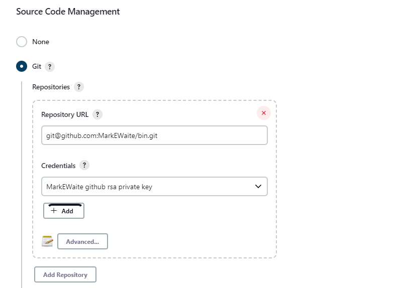

The git plugin fetches commits from one or more remote repositories and performs a checkout in the agent workspace.
Repositories and their related information include:

Repository URL::

  The URL of the remote repository.
  The git plugin passes the remote repository URL to the git implementation (command line or JGit).
  Valid repository URL's include `https`, `ssh`, `scp`, `git`, `local file`, and other forms.
  Valid repository URL forms are described in the link:https://git-scm.com/book/en/v2/Git-on-the-Server-The-Protocols#_the_protocols[git documentation].

Credentials::

  Credentials are defined using the link:https://plugins.jenkins.io/credentials[Jenkins credentials plugin].
  They are selected from a drop-down list and their identifier is stored in the job definition.
  Refer to <<using-credentials,using credentials>> for more details on supported credential types.

Name::

  Git uses a short name to simplify user references to the URL of the remote repository.
  The default short name is `origin`.
  Other values may be assigned and then used throughout the job definition to refer to the remote repository.

Refspec::

  A refspec maps remote branches to local references.
  It defines the branches and tags which will be fetched from the remote repository into the agent workspace.
+
A refspec defines the remote references that will be retrieved and how they map to local references.
If left blank, it will default to the normal `git fetch` behavior and will retrieve all branches.
This default behavior is sufficient for most cases.
+
The default refspec is `+refs/heads/*:refs/remotes/REPOSITORYNAME/` where REPOSITORYNAME is the value you specify in the above repository "Name" field.
The default refspec retrieves all branches.
If a checkout only needs one branch, then a more restrictive refspec can reduce the data transfer from the remote repository to the agent workspace.
For example, `+refs/heads/master:refs/remotes/origin/master` will retrieve only the master branch and nothing else.
+
The refspec can be used with the <<honor-refspec-on-initial-clone,honor refspec on initial clone>> option in the <<advanced-clone-behaviours,advanced clone behaviors>> to limit the number of remote branches mapped to local references.
If "honor refspec on initial clone" is not enabled, then a default refspec for its initial fetch.
This maintains compatibility with previous behavior and allows the job definition to decide if the refspec should be honored on initial clone.
+
Multiple refspecs can be entered by separating them with a space character.
The refspec value `+refs/heads/master:refs/remotes/origin/master +refs/heads/develop:refs/remotes/origin/develop` retrieves the master branch and the develop branch and nothing else.
+
Refer to the link:https://git-scm.com/book/en/v2/Git-Internals-The-Refspec[git refspec documentation] for more refspec details.

[#using-credentials]
=== Using Credentials

The git plugin supports username / password credentials and private key credentials provided by the
https://plugins.jenkins.io/credentials[Jenkins credentials plugin].
It does not support other credential types like secret text, secret file, or certificates.
Select credentials from the job definition drop down menu or enter their identifiers in Pipeline job definitions.

When the remote repository is accessed with the **HTTP or HTTPS protocols**, the plugin requires a **username / password credential**.
Other credential types will not work with HTTP or HTTPS protocols.

When the remote repository is accessed with the **ssh protocol**, the plugin requires an **ssh private key credential**.
Other credential types will not work with the ssh protocol.

[#push-notification-from-repository]
=== [[GitPlugin-Pushnotificationfromrepository]]Push Notification From Repository

To minimize the delay between a push and a build, configure the remote repository to use a Webhook to notify Jenkins of changes to the repository.
Refer to webhook documentation for your repository:

* link:https://plugins.jenkins.io/github/#plugin-content-github-hook-trigger-for-gitscm-polling[GitHub]
* link:https://plugins.jenkins.io/bitbucket[Bitbucket]
* link:https://plugins.jenkins.io/gitlab-branch-source[GitLab]
* link:https://github.com/jenkinsci/gitea-plugin/blob/master/docs/README.md[Gitea]
* link:https://docs.tuleap.org/user-guide/code-versioning/git.html#jenkins-webhooks[Tuleap]

Other git repositories can use a link:https://git-scm.com/book/en/v2/Customizing-Git-Git-Hooks[post-receive hook] in the remote repository to notify Jenkins of changes.  The `notifyCommit` endpoint can take four parameters.

* `url` (required) should match the URL in which a Jenkins job is configured to clone.
* `branches` (optional) is a comma separated list of one or more branches meant for multi-branch pipelines.
* `sha1` (optional) the SHA1 Git commit hash which triggered the notification.
* `token` (optional) a secret token which must match the Jenkins configuration.  Jenkins ignores non-matching token requests.

Add the following line in your `hooks/post-receive` file on the git server, replacing <URL of the Git repository> with the fully qualified URL you use when cloning the repository, and replacing <Access token> with a token generated by a Jenkins administrator using the "Git plugin notifyCommit access tokens" section of the "Configure Global Security" page.

....
curl "http://yourserver/git/notifyCommit?url=<URL of the Git repository>&token=<Access token>"
....

This will scan all the jobs that:

* Have Build Triggers > Poll SCM enabled.  No polling schedule is required.
* Are configured to build the repository at the specified URL

For jobs that meet these conditions, polling will be triggered.
If polling finds a change worthy of a build, a build will be triggered.

This allows a notify script to remain the same for all Jenkins jobs.
Or if you have multiple repositories under a single repository host application (such as Gitosis), you can share a single post-receive hook script with all the repositories.

When notifyCommit is successful, the list of triggered projects is returned.

The `token` parameter is required by default as a security measure, but can be disabled by the following link:https://www.jenkins.io/doc/book/managing/system-properties/[system property]:

....
hudson.plugins.git.GitStatus.NOTIFY_COMMIT_ACCESS_CONTROL
....

It has two modes:

* `disabled-for-polling` - Allows unauthenticated requests as long as they only request polling of the repository supplied in the `url` query parameter. Prohibits unauthenticated requests that attempt to schedule a build immediately by providing a
`sha1` query parameter.
* `disabled` - Fully disables the access token mechanism and allows all requests to `notifyCommit`
to be unauthenticated. *This option is insecure and is not recommended.*

You can set the `NOTIFY_COMMIT_ACCESS_CONTROL` value with either a link:https://www.jenkins.io/doc/book/managing/system-properties/[system property] or a link:https://www.jenkins.io/doc/book/managing/groovy-hook-scripts/[Groovy hook script].

[[using-a-system-property-push-notification]]
Using a system property::

The `NOTIFY_COMMIT_ACCESS_CONTROL` value can be set from the command line that starts Jenkins.
This method is useful for environments where initial Jenkins settings are managed with command line arguments.
+
....
java -Dhudson.plugins.git.GitStatus.NOTIFY_COMMIT_ACCESS_CONTROL=disabled-for-polling -jar jenkins.war
....

[[using-a-groovy-script-push-notification]]
 Using a Groovy script::

The `NOTIFY_COMMIT_ACCESS_CONTROL` value can be set using a Groovy script placed in the `init.groovy.d` subdirectory of the Jenkins home directory.
This method is useful for environments where Jenkins settings are managed with link:https://www.jenkins.io/doc/book/managing/groovy-hook-scripts/#post-initialization-script-init-hook[Groovy post-initialization scripts].
+
----
hudson.plugins.git.GitStatus.NOTIFY_COMMIT_ACCESS_CONTROL='disabled-for-polling'
----

[#enabling-jgit]
=== Enabling JGit

See the link:https://plugins.jenkins.io/git-client/#plugin-content-enabling-jgit[git client plugin documentation] for instructions to enable JGit.
JGit becomes available throughout Jenkins once it has been enabled.

[#global-configuration]
=== [[GitPlugin-Configuration]]Global Configuration

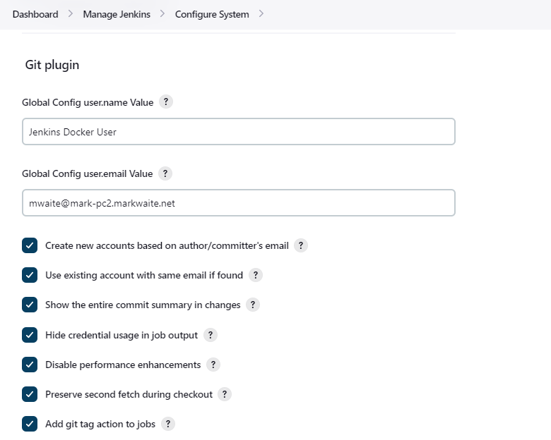

In the `Configure System` page, the Git Plugin provides the following options:

[[global-config-user-name]]
Global Config user.name Value::

  Defines the default git user name that will be assigned when git commits a change from Jenkins.
  For example, `Janice Examplesperson`.
  This can be overridden by individual projects with the <<custom-user-name-e-mail-address>> extension.

[[global-config-user-email]]
Global Config user.email Value::

  Defines the default git user e-mail that will be assigned when git commits a change from Jenkins.
  For example, `janice.examplesperson@example.com`.
  This can be overridden by individual projects with the <<custom-user-name-e-mail-address>> extension.

[[create-new-accounts-based-on-author-email]]
Create new accounts based on author/committer's email::

  New user accounts are created in Jenkins for committers and authors identified in changelogs.
  The new user accounts are added to the internal Jenkins database.
  The e-mail address is used as the id of the account.

[[show-the-entire-commit-summary-in-changes]]
Show the entire commit summary in changes::

  The `changes` page for each job would truncate the change summary prior to git plugin 4.0.
  With the release of git plugin 4.0, the default was changed to show the complete change summary.
  Administrators that want to restore the old behavior may disable this setting.

[[hide-credentials]]
Hide credential usage in job output::

  If checked, the console log will not show the credential identifier used to clone a repository.

[[disable-performance-enhancements]]
Disable performance enhancements::

  If JGit and command line git are both enabled on an agent, the git plugin uses a "git tool chooser" to choose a preferred git implementation.
  The preferred git implementation depends on the size of the repository and the git plugin features requested by the job.
  If the repository size is *less than* the JGit repository size threshold and the git features of the job are all implemented in JGit, then JGit is used.
  If the repository size is *greater than* the JGit repository size threshold or the job requires git features that are not implemented in JGit, then command line git is used.
+
If checked, the plugin will disable the feature that recommends a git implementation on the basis of the size of a repository.
This switch may be used in case of a bug in the performance improvement feature.
If you enable this setting, please report a git plugin issue that describes why you needed to enable it.

[[preserve-second-fetch-during-checkout]]
Preserve second fetch during initial checkout::

  If checked, the initial checkout step will not avoid the second fetch.
  Git plugin versions prior to git plugin 4.4 would perform two fetch operations during the initial repository checkout.
  Git plugin 4.4 removes the second fetch operation in most cases.
  Enabling this option will restore the second fetch operation.
  This setting is only needed if there is a bug in the redundant fetch removal logic.
  If you enable this setting, please report a git plugin issue that describes why you needed to enable it.

[[do-not-add-git-tag-action-to-jobs]]
Add git tag action to jobs::

  If checked, the git tag action will be added to any builds that happen *after* the box is checked.
  Prior to git plugin 4.5.0, the git tag action was always added.
  Git plugin 4.5.0 and later will not add the git tag action to new builds unless the administrator enables it.
+
The git tag action allows a user to apply a tag to the git repository in the workspace based on the git commit used in the build applying the tag.
The git plugin does *not* push the applied tag to any other location.
If the workspace is removed, the tag that was applied is lost.
Tagging a workspace made sense when using centralized repositories that automatically applied the tag to the centralized repository.
Applying a git tag in an agent workspace doesn't have many practical uses.

[#configuration-as-code]
=== Configuration as code

The global settings of the git plugin can be defined with the Jenkins link:https://plugins.jenkins.io/configuration-as-code/[configuration as code plugin].
Detailed descriptions of the individual settings are available in the link:#global-configuration[global configuration settings] section of this document.

An example configuration might look like this:

[,yaml]
----
security:
  gitHooks:
    allowedOnAgents: false
    allowedOnController: false
unclassified:
  scmGit:
    addGitTagAction: false
    allowSecondFetch: false
    createAccountBasedOnEmail: false
    disableGitToolChooser: false
    globalConfigEmail: "jenkins-user@example.com"
    globalConfigName: "jenkins-user"
    hideCredentials: false
    showEntireCommitSummaryInChanges: true
    useExistingAccountWithSameEmail: false
----

[#security-configuration]

=== Security Configuration

image:/images/git-security-configuration.png[Security Configuration]

In the `Configure Global Security` page, the Git Plugin provides the following option:

[[global-security-git-hooks]]
Git Hooks::

  link:https://git-scm.com/book/en/v2/Customizing-Git-Git-Hooks[Git hooks] allow scripts to be invoked when certain important git repository actions occur.
  This configuration controls the execution of client-side hooks on the controller and on agents.
  It is recommended that git hooks be **disabled** on the controller and on agents.
+
Most git repositories do not use hooks in the repository and do not need repository hooks.
In those rare cases where repository hooks are needed, it is highly recommended that they are **disabled** on the Jenkins controller and on Jenkins agents.
+
Client-side hooks are **not** copied when the repository is cloned by Jenkins using the inbuilt SCM methods.
However, client-side hooks might be installed in a repository by build steps or by misconfiguration.
+
If hook scripts are allowed, a client-side hook script installed in a repository will execute when the matching git operation is performed.
For example, if hooks are allowed and a git repository includes a `post-checkout` hook, the hook script will run after any checkout in that repository.
If hooks are allowed and a git repository includes a `pre-auto-gc` hook, the hook script will run before any automatic git garbage collection task.
+
See link:https://git-scm.com/book/en/v2/Customizing-Git-Git-Hooks["Customizing Git - Git Hooks"] for more details about git repository hooks.

[#repository-browser]
=== Repository Browser


A Repository Browser adds links in "changes" views within Jenkins to an external system for browsing the details of those changes.
The "Auto" selection attempts to infer the repository browser from the "Repository URL" and can detect cloud versions of GitHub, Bitbucket and GitLab.

Repository browsers include:

[#assemblaweb-repository-browser]
==== AssemblaWeb


Repository browser for git repositories hosted by link:https://www.assembla.com/home[Assembla].
Options include:

[[assembla-git-url]]
Assembla Git URL::

  Root URL serving this Assembla repository.
  For example, `\https://app.assembla.com/spaces/git-plugin/git/source`

[#fisheye-repository-browser]
==== FishEye

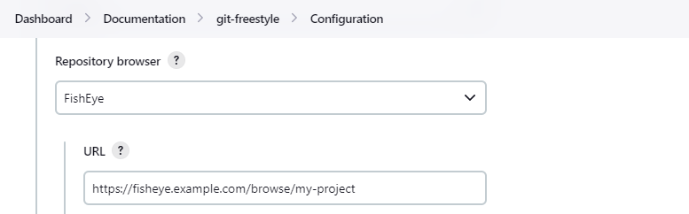

Repository browser for git repositories hosted by link:https://www.atlassian.com/software/fisheye[Atlassian Fisheye].
Options include:

[[fisheye-url]]
URL::

  Root URL serving this FishEye repository.
  For example, `\https://fisheye.example.com/browse/my-project`

[#kiln-repository-browser]
==== Kiln


Repository browser for git repositories hosted by link:http://www.fogbugz.com/version-control[Kiln].
Options include:

[[kiln-url]]
URL::

  Root URL serving this Kiln repository.
  For example, `\https://kiln.example.com/username/my-project`

[#visual-studio-team-services-repository-browser]
==== Microsoft Team Foundation Server/Visual Studio Team Services

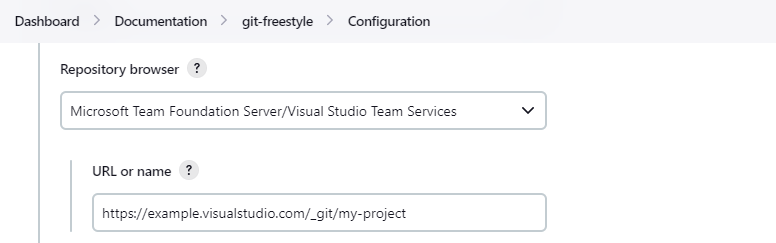

Repository browser for git repositories hosted by link:https://azure.microsoft.com/en-us/solutions/devops/[Azure DevOps].
Options include:

[[visual-studio-repository-url-or-name]]
URL or name::

  Root URL serving this Azure DevOps repository.
  For example, `\https://dev.azure.com/example/_git/my-project`

[bitbucketweb-repository-browser]
==== bitbucketweb


Repository browser for git repositories hosted by link:https://bitbucket.org/[Bitbucket].
Options include:

[[bitbucketweb-url]]
URL::

  Root URL serving this Bitbucket repository.
  For example, `\https://bitbucket.org/username/my-project`

[bitbucketserver-repository-browser]
==== bitbucketserver


Repository browser for git repositories hosted by an on-premises Bitbucket Server installation.
Options include:

[[bitbucketserver-url]]
URL::

  Root URL serving this Bitbucket repository.
  For example, `\https://bitbucket.example.com/username/my-project`

[#cgit-repository-browser]
==== cgit


Repository browser for git repositories hosted by link:https://git.zx2c4.com/cgit/[cgit].
Options include:

[[cgit-url]]
URL::

  Root URL serving this cgit repository.
  For example, `\https://git.zx2c4.com/cgit/`

[#gitblit-repository-browser]
==== gitblit

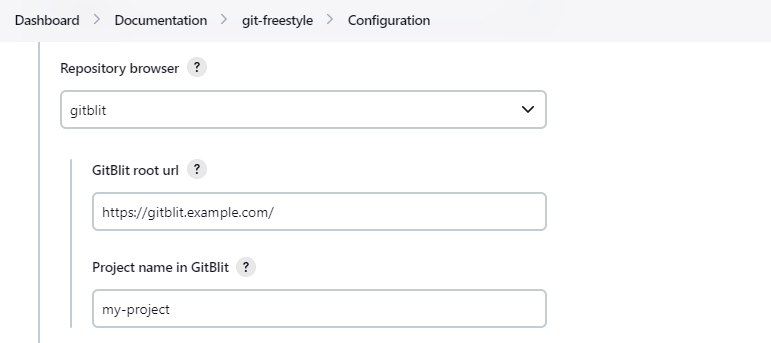

[[gitblit-url]]
GitBlit root url::

  Root URL serving this GitBlit repository.
  For example, `\https://gitblit.example.com/`

[[gitblit-project-name]]
Project name in GitBlit::

  Name of the GitBlit project.
  For example, `my-project`

[#githubweb-repository-browser]
==== githubweb

image:images/git-repository-browser-github.png[GitHub Repository Browser]

Repository browser for git repositories hosted by link:https://github.com//[GitHub].
Options include:

[[githubweb-url]]
URL::

  Root URL serving this GitHub repository.
  For example, `\https://github.example.com/username/my-project`

[#gitiles-repository-browser]
==== gitiles

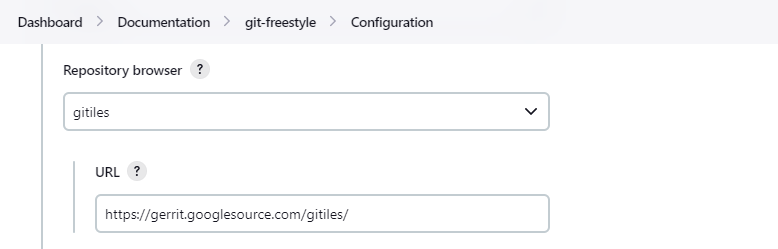

Repository browser for git repositories hosted by link:https://gerrit.googlesource.com/gitiles/[Gitiles].
Options include:

[[githubweb-url]]
gitiles root url::

  Root URL serving this Gitiles repository.
  For example, `\https://gerrit.googlesource.com/gitiles/`

[#gitlab-self-hosted-repository-browser]
[#gitlab-com-repository-browser]
==== gitlab


Repository browser for git repositories hosted by link:https://gitlab.com/[GitLab].
Options include:

[[gitlab-url]]
URL::

  Root URL serving this GitLab repository.
  For example, `\https://gitlab.example.com/username/my-project`

[[gitlab-version]]
Version::

  Major and minor version of GitLab you use, such as 15.6.
  If you don't specify a version, a modern version of GitLab (>= 8.0) is assumed.
  For example, `15.6`

[#gitlist-repository-browser]
==== gitlist

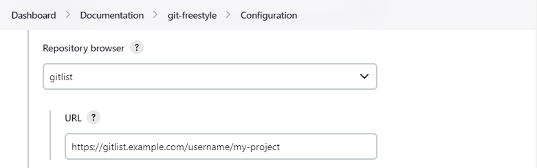

Repository browser for git repositories hosted by link:https://gitlist.org/[GitList].
Options include:

[[gitlist-url]]
URL::

  Root URL serving this GitList repository.
  For example, `\https://gitlist.example.com/username/my-project`

[#gitoriousweb-repository-browser]
==== gitoriousweb

Gitorious was acquired in 2015.
This browser is *deprecated*.

[[gitoriousweb-url]]
URL::

  Root URL serving this Gitorious repository.
  For example, `\https://gitorious.org/username/my-project`

[#gitweb-repository-browser]
==== gitweb


Repository browser for git repositories hosted by link:https://git-scm.com/docs/gitweb[GitWeb].
Options include:

[[gitweb-url]]
URL::

  Root URL serving this GitWeb repository.
  For example, `\https://gitweb.example.com/username/my-project`

[#gogs-repository-browser]
==== gogs

image:images/git-repository-browser-gogs.png[Gogs Repository Browser]

Repository browser for git repositories hosted by link:https://gogs.io/[Gogs].
Options include:

[[gogs-url]]
URL::

  Root URL serving this Gogs repository.
  For example, `\https://gogs.example.com/username/my-project`

[#phabricator-repository-browser]
==== phabricator

Effective June 1, 2021, Phabricator is link:https://admin.phacility.com/phame/post/view/11/phacility_is_winding_down_operations/[no longer actively maintained].
This browser is *deprecated*.

[[phabricator-url]]
URL::

  Root URL serving this Phabricator repository.
  For example, `\https://phabricator.example.com/`

[[phabricator-repository-name]]
Repository name in Phab::

  Name of the Phabricator repository.
  For example, `my-project`

[#redmineweb-repository-browser]
==== redmineweb

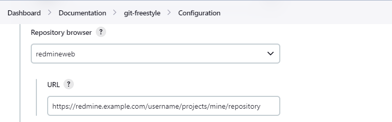

Repository browser for git repositories hosted by link:https://www.redmine.org/[Redmine].
Options include:

[[redmineweb-url]]
URL::

  Root URL serving this Redmine repository.
  For example, `\https://redmine.example.com/username/projects/my-project/repository`

[#rhodecode-repository-browser]
==== rhodecode


Repository browser for git repositories hosted by link:https://thodecode.com/[RhodeCode].
Options include:

[[rhodecode-url]]
URL::

  Root URL serving this RhodeCode repository.
  For example, `\https://rhodecode.example.com/username/my-project`

[#stash-repository-browser]
==== stash

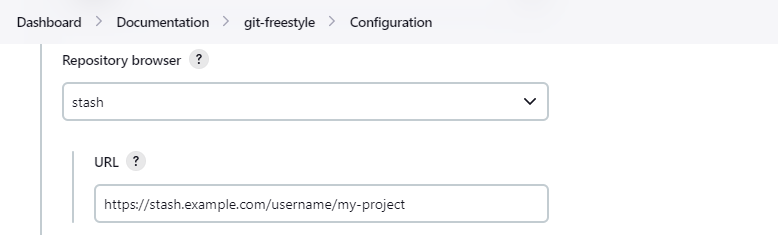

Stash is now called *BitBucket Server*.
Repository browser for git repositories hosted by link:https://www.atlassian.com/software/bitbucket[BitBucket Server].
Options include:

[[stash-url]]
URL::

  Root URL serving this Stash repository.
  For example, `\https://stash.example.com/username/my-project`

[#viewgit-repository-browser]
==== viewgit


Repository browser for git repositories hosted by link:https://www.openhub.net/p/viewgit[viewgit].
Options include:

[[viewgit-root-url]]
ViewGit root url::

  Root URL serving this ViewGit repository.
  For example, `\https://viewgit.example.com/`

[[viewgit-project-name]]
Project Name in ViewGit::

  ViewGit project name.
  For example, `my-project`

[#git-bindings]
== Git Credential Binding

The git plugin provides one binding to support authenticated git operations over *HTTP* or *HTTPS* protocol, namely `Git Username and Password`.
The git plugin depends on the Credential Binding Plugin to support these bindings.

To access the `Git Username and Password` binding in a Pipeline job, visit <<credential-binding>>

Freestyle projects can use git credential binding with the following steps:

. Check the box _Use secret text(s) or file(s)_, add Git Username and Password binding.

. Choose the required credentials and Git tool name.


Two variable bindings are used, `GIT_USERNAME` and `GIT_PASSWORD`, to pass the username and password to shell, batch, and powershell steps in a Freestyle job.
The variable bindings are available even if the `JGit` or `JGit with Apache HTTP Client` git implementation is being used.

[#extensions]
== Extensions

Extensions add new behavior or modify existing plugin behavior for different uses.
Extensions help users more precisely tune the plugin to meet their needs.

Extensions include:

- <<clone-extensions>>
- <<checkout-extensions>>
- <<changelog-extensions>>
- <<tagging-extensions>>
- <<build-initiation-extensions>>
- <<merge-extensions>>
- <<deprecated-extensions>>

[#clone-extensions]
=== Clone Extensions

Clone extensions modify the git operations that retrieve remote changes into the agent workspace.
The extensions can adjust the amount of history retrieved, how long the retrieval is allowed to run, and other retrieval details.

[#advanced-clone-behaviours]
==== Advanced clone behaviours


Advanced clone behaviors modify the `link:https://git-scm.com/docs/git-clone[git clone]` and `link:https://git-scm.com/docs/git-fetch[git fetch]` commands.
They control:

* breadth of history retrieval (refspecs)
* depth of history retrieval (shallow clone)
* disc space use (reference repositories)
* duration of the command (timeout)
* tag retrieval

Advanced clone behaviors include:

[[honor-refspec-on-initial-clone]]
Honor refspec on initial clone::

  Perform initial clone using the refspec defined for the repository.
  This can save time, data transfer and disk space when you only need to access the references specified by the refspec.
  If this is not enabled, then the plugin default refspec includes **all** remote branches.

Shallow clone::

  Perform a shallow clone by requesting a limited number of commits from the tip of the requested branch(es).
  Git will not download the complete history of the project.
  This can save time and disk space when you just want to access the latest version of a repository.

Shallow clone depth::

  Set shallow clone depth to the specified number of commits.
  Git will only download `depth` commits from the remote repository, saving time and disk space.

Path of the reference repo to use during clone::

  Specify a folder containing a repository that will be used by git as a reference during clone operations.
  This option will be ignored if the folder is not available on the agent.

Timeout (in minutes) for clone and fetch operations::

  Specify a timeout (in minutes) for clone and fetch operations.

Fetch tags::

  Deselect this to perform a clone without tags, saving time and disk space when you want to access only what is specified by the refspec, without considering any repository tags.

[#prune-stale-remote-tracking-branches]
==== Prune stale remote tracking branches


Removes remote tracking branches from the local workspace if they no longer exist on the remote.
See `link:https://git-scm.com/docs/git-remote#Documentation/git-remote.txt-empruneem[git remote prune]` and `link:https://git-scm.com/docs/git-fetch#_pruning[git fetch --prune]` for more details.

[#prune-stale-tags]
==== Prune stale tags


Removes tags from the local workspace before fetch if they no longer exist on the remote.
If stale tags are not pruned, deletion of a remote tag will not remove the local tag in the workspace.
If the local tag already exists in the workspace, git correctly refuses to create the tag again.
Pruning stale tags allows the local workspace to create a tag with the same name as a tag which was removed from the remote.

[#checkout-extensions]
=== Checkout Extensions

Checkout extensions modify the git operations that place files in the workspace from the git repository on the agent.
The extensions can adjust the maximum duration of the checkout operation, the use and behavior of git submodules, the location of the workspace on the disc, and more.

[#advanced-checkout-behaviors]
==== Advanced checkout behaviors

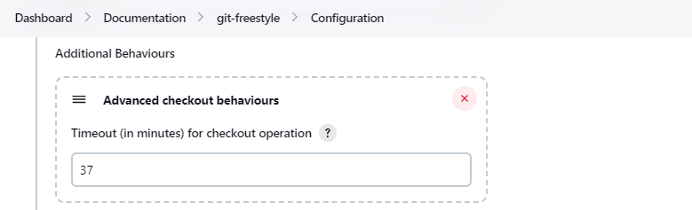

Advanced checkout behaviors modify the `link:https://git-scm.com/docs/git-checkout[git checkout]` command.
Advanced checkout behaviors include

Timeout (in minutes) for checkout operation::

  Specify a timeout (in minutes) for checkout.
  The checkout is stopped if the timeout is exceeded.
  Checkout timeout is usually only required with slow file systems or large repositories.

[#advanced-sub-modules-behaviours]
==== Advanced sub-modules behaviours

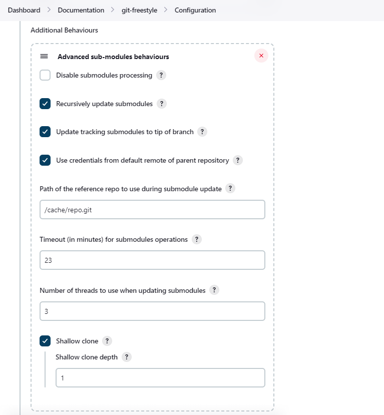

Advanced sub-modules behaviors modify the `link:https://git-scm.com/docs/git-submodule[git submodule]` commands.
They control:

* depth of history retrieval (shallow clone)
* disc space use (reference repositories)
* credential use
* duration of the command (timeout)
* concurrent threads used to fetch submodules

Advanced sub-modules include:

Disable submodules processing::

  Ignore submodules in the repository.

Recursively update submodules::

  Retrieve all submodules recursively. Without this option, submodules
  which contain other submodules will ignore the contained submodules.

Update tracking submodules to tip of branch::

  Retrieve the tip of the configured branch in .gitmodules.

Use credentials from default remote of parent repository::

  Use credentials from the default remote of the parent project.
  Submodule updates do not use credentials by default.
  Enabling this extension will provide the parent repository credentials to each of the submodule repositories.
  Submodule credentials require that the submodule repository must accept the same credentials as the parent project.
  If the parent project is cloned with https, then the authenticated submodule references must use https as well.
  If the parent project is cloned with ssh, then the authenticated submodule references must use ssh as well.

Path of the reference repo to use during submodule update::

  Folder containing a repository that will be used by git as a reference during submodule clone operations.
  This option will be ignored if the folder is not available on the agent running the build.
  A reference repository may contain multiple subprojects.
  See the combining repositories section for more details.

Timeout (in minutes) for submodule operations::

  Specify a timeout (in minutes) for submodules operations.
  This option overrides the default timeout.

Number of threads to use when updating submodules::

  Number of parallel processes to be used when updating submodules.
  Default is to use a single thread for submodule updates

Shallow clone::

  Perform shallow clone of submodules.
  Git will not download the complete history of the project, saving time and disk space.

Shallow clone depth::

  Set shallow clone depth for submodules.
  Git will only download recent history of the project, saving time and disk space.

[#checkout-to-a-sub-directory]
==== Checkout to a sub-directory


Checkout to a subdirectory of the workspace instead of using the workspace root.

This extension should **not** be used in Jenkins Pipeline (either declarative or scripted).
Jenkins Pipeline already provides standard techniques for checkout to a subdirectory.
Use `ws` and `dir` in Jenkins Pipeline rather than this extension.

Local subdirectory for repo::

  Name of the local directory (relative to the workspace root) for the git repository checkout.
  If left empty, the workspace root itself will be used.

[#checkout-to-specific-local-branch]
==== Checkout to specific local branch

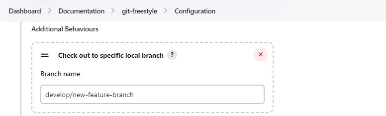

Branch name::

  If given, checkout the revision to build as HEAD on the named branch.
  If value is an empty string or "**", then the branch name is computed from the remote branch without the origin.
  In that case, a remote branch 'origin/master' will be checked out to a local branch named 'master', and a remote branch 'origin/develop/new-feature' will be checked out to a local branch named 'develop/new-feature'.
  If a specific revision and not branch HEAD is checked out, then 'detached' will be used as the local branch name.

[#wipe-out-repository-and-force-clone]
==== Wipe out repository and force clone


Delete the contents of the workspace before build and before checkout.
Deletes the git repository inside the workspace and will force a full clone.

[clean-after-checkout]
==== Clean after checkout

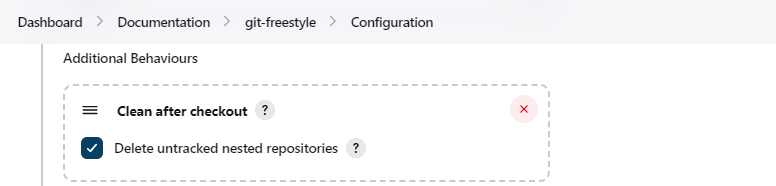

Clean the workspace *after* every checkout by deleting all untracked files and directories, including those which are specified in `.gitignore`.
Resets all tracked files to their versioned state.
Ensures that the workspace is in the same state as if clone and checkout were performed in a new workspace.
Reduces the risk that current build will be affected by files generated by prior builds.
Does not remove files outside the workspace (like temporary files or cache files).
Does not remove files in the `.git` repository of the workspace.

Delete untracked nested repositories::

  Remove subdirectories which contain `.git` subdirectories if this option is enabled.
  This is implemented in command line git as `git clean -xffd`.
  Refer to the link:https://git-scm.com/docs/git-clean[git clean manual page] for more information.

[#clean-before-checkout]
==== Clean before checkout

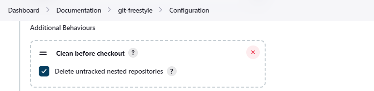

Clean the workspace *before* every checkout by deleting all untracked files and directories, including those which are specified in .gitignore.
Resets all tracked files to their versioned state.
Ensures that the workspace is in the same state as if cloned and checkout were performed in a new workspace.
Reduces the risk that current build will be affected by files generated by prior builds.
Does not remove files outside the workspace (like temporary files or cache files).
Does not remove files in the `.git` repository of the workspace.

Delete untracked nested repositories::

  Remove subdirectories which contain `.git` subdirectories if this option is enabled.
  This is implemented in command line git as `git clean -xffd`.
  Refer to the link:https://git-scm.com/docs/git-clean[git clean manual page] for more information.

[#sparse-checkout-paths]
==== Sparse checkout paths

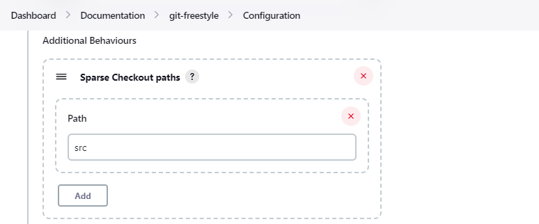

Specify the paths that you'd like to sparse checkout.
This may be used for saving space (Think about a reference repository).
Be sure to use a recent version of Git, at least above 1.7.10.

Multiple sparse checkout path values can be added to a single job.

Path::

  File or directory to be included in the checkout

[source,groovy]
----
checkout scmGit(
    branches: [[name: 'master']],
    extensions: [
        sparseCheckout(sparseCheckoutPaths: [[path: 'src'], [path: 'Makefile']])
    ],
    userRemoteConfigs: [[url: 'https://github.com/jenkinsci/git-plugin.git']])
----

[#git-lfs-pull-after-checkout]
==== Git LFS pull after checkout


Enable https://git-lfs.github.com/[git large file support] for the workspace by pulling large files after the checkout completes.
Requires that the controller and each agent performing an LFS checkout have installed `git lfs`.

[#changelog-extensions]
=== Changelog Extensions

The plugin can calculate the source code differences between two builds.
Changelog extensions adapt the changelog calculations for different cases.

[#calculate-changelog-against-a-specific-branch]
==== Calculate changelog against a specific branch

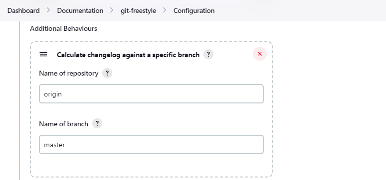

'Calculate changelog against a specific branch' uses the specified branch to compute the changelog instead of computing it based on the previous build.
This extension can be useful for computing changes related to a known base branch, especially in environments which do not have the concept of a "pull request".

Name of repository::

  Name of the repository, such as 'origin', that contains the branch.

Name of branch::

  Name of the branch used for the changelog calculation within the named repository.

[#use-commit-author-in-changelog]
==== Use commit author in changelog

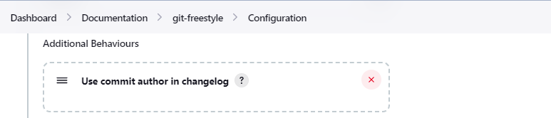

The default behavior is to use the Git commit's "Committer" value in build changesets.
If this option is selected, the git commit's "Author" value is used instead.

[#tagging-extensions]
=== Tagging Extensions

Tagging extensions allow the plugin to apply tags in the current workspace.

[#create-a-tag-for-every-build]
==== Create a tag for every build

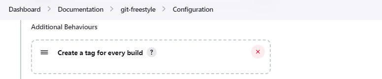

Create a tag in the workspace for every build to unambiguously mark the commit that was built.
You can combine this with Git publisher to push the tags to the remote repository.

[#build-initiation-extensions]
=== Build Initiation Extensions

The git plugin can start builds based on many different conditions.
The build initiation extensions control the conditions that start a build.
They can ignore notifications of a change or force a deeper evaluation of the commits when polling

[#dont-trigger-a-build-on-commit-notifications]
==== Don't trigger a build on commit notifications


If checked, this repository will be ignored when the notifyCommit URL is accessed whether the repository matches or not.

[#force-polling-using-workspace]
==== Force polling using workspace

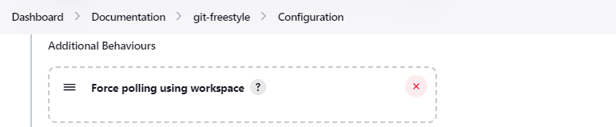

The git plugin polls remotely using `ls-remote` when configured with a single branch (no wildcards!).
When this extension is enabled, the polling is performed from a cloned copy of the workspace instead of using `ls-remote`.

If this option is selected, polling will use a workspace instead of using `ls-remote`.

By default, the plugin polls by executing a polling process or thread on the Jenkins controller.
If the Jenkins controller does not have a git installation, the administrator may <<enabling-jgit,enable JGit>> to use a pure Java git implementation for polling.
In addition, the administrator may need to <<GitPlugin-WhyNotJGit,disable command line git>> to prevent use of command line git on the Jenkins controller.

[#polling-ignores-commits-from-certain-users]
==== Polling ignores commits from certain users


These options allow you to perform a merge to a particular branch before building.
For example, you could specify an integration branch to be built, and to merge to master.
In this scenario, on every change of integration, Jenkins will perform a merge with the master branch, and try to perform a build if the merge is successful.
It then may push the merge back to the remote repository if the Git Push post-build action is selected.

Excluded Users::

  If set and Jenkins is configured to poll for changes, Jenkins will ignore any revisions committed by users in this list when determining if a build should be triggered.
  This can be used to exclude commits done by the build itself from triggering another build, assuming the build server commits the change with a distinct SCM user.
  Using this behavior prevents the faster `git ls-remote` polling mechanism.
  It forces polling to require a workspace, as if you had selected the <<force-polling-using-workspace,Force polling using workspace>> extension.

  Each exclusion uses exact string comparison and must be separated by a new line.
  User names are only excluded if they exactly match one of the names in this list.

[#polling-ignores-commits-in-certain-paths]
==== Polling ignores commits in certain paths

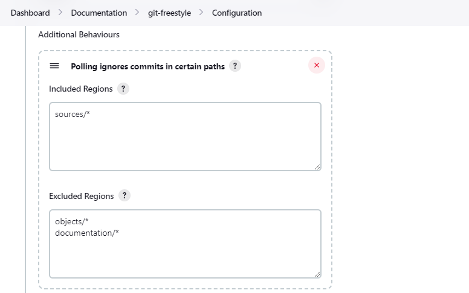

If set and Jenkins is configured to poll for changes, Jenkins will pay attention to included and/or excluded files and/or folders when determining if a build needs to be triggered.

Using this behavior will preclude the faster remote polling mechanism, forcing polling to require a workspace thus sometimes triggering unwanted builds, as if you had selected the <<force-polling-using-workspace,Force polling using workspace>> extension as well.
This can be used to exclude commits done by the build itself from triggering another build, assuming the build server commits the change with a distinct SCM user.
Using this behavior will preclude the faster git ls-remote polling mechanism, forcing polling to require a workspace, as if you had selected the <<force-polling-using-workspace,Force polling using workspace>> extension as well.

Included Regions::

  Each inclusion uses java regular expression pattern matching, and must be separated by a new line.
  An empty list implies that everything is included.

Excluded Regions::

  Each exclusion uses java regular expression pattern matching, and must be separated by a new line.
  An empty list excludes nothing.

[#polling-ignores-commits-with-certain-messages]
==== Polling ignores commits with certain messages


Excluded Messages::

  If set and Jenkins is set to poll for changes, Jenkins will ignore any revisions committed with message matched to the regular expression pattern when determining if a build needs to be triggered.
  This can be used to exclude commits done by the build itself from triggering another build, assuming the build server commits the change with a distinct message.
  You can create more complex patterns using embedded flag expressions.

[#strategy-for-choosing-what-to-build]
==== Strategy for choosing what to build

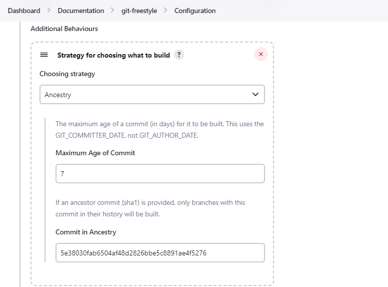

When you are interested in using a job to build multiple branches, you can choose how Jenkins chooses the branches to build and the order they should be built.

This extension point in Jenkins is used by many other plugins to control the job as it builds specific commits.
When you activate those plugins, you may see them installing a custom build strategy.

Ancestry::

Maximum Age of Commit::

  The maximum age of a commit (in days) for it to be built.
  This uses the GIT_COMMITTER_DATE, not GIT_AUTHOR_DATE

Commit in Ancestry::

  If an ancestor commit (SHA-1) is provided, only branches with this commit in their history will be built.

Default::

  Build all the branches that match the branch name pattern.

Inverse::

  Build all branches except for those which match the branch specifiers configure above.
  This is useful, for example, when you have jobs building your master and various release branches and you want a second job which builds all new feature branches.
  For example, branches which do not match these patterns without redundantly building master and the release branches again each time they change.

[#first-build-changelog]
==== First build changelog

image:/images/git-extension-for-first-build.png[First build changelog]

The Jenkins git plugin provides an option to trigger a Pipeline build on the first commit on a branch.
By default, no changelog is generated for the first build because the first build has no predecessor build for comparison.
When the first build changelog option is enabled, the most recent commit will be used as the changelog of the first build.

[source,groovy]
----
checkout scmGit(
    branches: [[name: 'master']],
    extensions: [ firstBuildChangelog() ],
    userRemoteConfigs: [[url: 'https://github.com/jenkinsci/git-plugin.git']])
----

[#merge-extensions]
=== Merge Extensions

The git plugin can optionally merge changes from other branches into the current branch of the agent workspace.
Merge extensions control the source branch for the merge and the options applied to the merge.

[#merge-before-build]
==== Merge before build


These options allow you to perform a merge to a particular branch before building.
For example, you could specify an integration branch to be built, and to merge to master.
In this scenario, on every change of integration, Jenkins will perform a merge with the master branch, and try to perform a build if the merge is successful.
It then may push the merge back to the remote repository if the <<publisher-push-merge-results,Git Publisher post-build action>> is selected.

Name of repository::

  Name of the repository, such as origin, that contains the branch. If
  left blank, it'll default to the name of the first repository
  configured.

Branch to merge to::

  The name of the branch within the named repository to merge to, such as
  master.

Merge strategy::

  Merge strategy selection. Choices include:

* default
* resolve
* recursive
* octopus
* ours
* subtree
* recursive_theirs

Fast-forward mode::

* `--ff`: fast-forward which gracefully falls back to a merge commit when required
* `-ff-only`: fast-forward without any fallback
* `--no-ff`: merge commit always, even if a fast-forward would have been allowed

[#custom-user-name-e-mail-address]
==== Custom user name/e-mail address

image:images/git-custom-user-name-e-mail-address.png[Custom user name/e-mail address]

user.name::

  Defines the user name value which git will assign to new commits made in the workspace.
  If given, the environment variables `GIT_COMMITTER_NAME` and `GIT_AUTHOR_NAME` are set for builds and override values from the global settings.

user.email::

  Defines the user email value which git will assign to new commits made in the workspace.
  If given, the environment variables `GIT_COMMITTER_EMAIL` and `GIT_AUTHOR_EMAIL` are set for builds and override values from the global settings.

[#deprecated-extensions]
=== Deprecated Extensions

[#custom-scm-name---deprecated]
==== Custom SCM name - *Deprecated*

Unique name for this SCM.
Was needed when using Git within the Multi SCM plugin.
Pipeline is the robust and feature-rich way to checkout from multiple repositories in a single job.

[#submodule-combinator---removed]
==== Submodule Combinator - *Removed*

An experiment was created many years ago that attempted to create combinations of submodules within the Jenkins job.
The experiment was never available to Freestyle projects or other legacy projects like multi-configuration projects.
It was visible in Pipeline, configuration as code, and JobDSL.

The implementation of the experiment has been removed.
Dependabot and other configuration tools are better suited to evaluate submodule combinations.

There are no known uses of the submodule combinator and no open Jira issues reported against the submodule combinator.
Those who were using submodule combinator should remain with git plugin versions prior to 4.6.0.

The submodule combinator ignores any user provided value of the following arguments to git's `checkout scm`:

doGenerateSubmoduleConfigurations::

  A boolean that is now always set to `false`.
  Submodule configurations are no longer evaluated by the git plugin.

submoduleCfg::

  A list of submodule names and branches that is now always empty.
  Submodule configurations are no longer evaluated by the git plugin.

Previous Pipeline syntax looked like this:

```groovy
checkout([$class: 'GitSCM',
    branches: [[name: 'master']],
    doGenerateSubmoduleConfigurations: false,
    extensions: [],
    submoduleCfg: [],
    userRemoteConfigs: [[url: 'https://github.com/jenkinsci/git-plugin']]])
```

Current Pipeline Syntax looks like this:

```groovy
checkout scmGit(
    branches: [[name: 'master']],
    userRemoteConfigs: [[url: 'https://github.com/jenkinsci/git-plugin']])
```

[#environment-variables]
== Environment Variables

The git plugin assigns values to environment variables in several contexts.
Environment variables are assigned in Freestyle, Pipeline, Multibranch Pipeline, and Organization Folder projects.

[#branch-variables]
=== Branch Variables

GIT_BRANCH:: Name of branch being built including remote name, as in `origin/master`
GIT_LOCAL_BRANCH:: Name of branch being built without remote name, as in `master`

[#commit-variables]
=== Commit Variables

GIT_COMMIT:: SHA-1 of the commit used in this build
GIT_PREVIOUS_COMMIT:: SHA-1 of the commit used in the preceding build of this project. If this is the first time a particular branch is being built, this variable is not set.
GIT_PREVIOUS_SUCCESSFUL_COMMIT:: SHA-1 of the commit used in the most recent successful build of this project. If this is the first time a particular branch is being built, this variable is not set.

[#system-configuration-variables]
=== System Configuration Variables

GIT_URL:: Remote URL of the first git repository in this workspace
GIT_URL_n:: Remote URL of the additional git repositories in this workspace (if any)
GIT_AUTHOR_EMAIL:: Author e-mail address that will be used for **new commits in this workspace**
GIT_AUTHOR_NAME:: Author name that will be used for **new commits in this workspace**
GIT_COMMITTER_EMAIL:: Committer e-mail address that will be used for **new commits in this workspace**
GIT_COMMITTER_NAME:: Committer name that will be used for **new commits in this workspace**

[#token-macro-variables]
=== Token Macro Variables

Some Jenkins plugins (like link:https://plugins.jenkins.io/email-ext/[email extension], link:https://plugins.jenkins.io/build-name-setter/[build name setter], and link:https://plugins.jenkins.io/description-setter/[description setter]) allow parameterized references to reformat the text of supported variables.
Variables that support parameterized references to reformat their text are called "token macros".
The git plugin provides token macros for:

GIT_REVISION:: Expands to the Git SHA1 commit ID that points to the commit that was built.
  length:: integer length of the commit ID that should be displayed.
  `${GIT_REVISION}` might expand to `a806ba7701bcfc9f784ccb7854c26f03e045c1d2`, while `${GIT_REVISION,length=8}` would expand to `a806ba77`.

GIT_BRANCH:: Expands to the name of the branch that was built.
  all:: boolean that expands to all branch names that point to the current commit when enabled.
  By default, the token expands to just one of the branch names
  fullName:: boolean that expands to the full branch name, such as `remotes/origin/master` or `origin/master`.
  Otherwise, it expands to the short name, such as `master`.

The most common use of token macros is in Freestyle projects.
Jenkins Pipeline supports a rich set of string operations so that token macros are not generally used in Pipelines.

When used with Pipeline, the token macro base values are generally assigned by the first checkout performed in a Pipeline.
Subsequent checkout operations do not modify the values of the token macros in the Pipeline.

[#properties]
== Properties

Some git plugin settings can only be controlled from command line properties set at Jenkins startup.

[#default-timeout]
=== Default Timeout

The default git timeout value (in minutes) can be overridden by the `org.jenkinsci.plugins.gitclient.Git.timeOut` property (see https://issues.jenkins.io/browse/JENKINS-11286[JENKINS-11286]).
The property should be set on the controller and on all agents to have effect (see https://issues.jenkins.io/browse/JENKINS-22547[JENKINS-22547]).

[[GitPlugin-WhyNotJGit]]
=== Disable command line git

Command line git is the reference git implementation in the git plugin and the git client plugin.
Command line git provides the most functionality and is the most stable implementation.
Some installations may not want to install command line git and may want to disable the command line git implementation.
Administrators may disable command line git with the property `org.jenkinsci.plugins.gitclient.Git.useCLI=false`.

[#allow-local-checkout]
=== Allow local checkout

Command line git and JGit can fetch a repository using a local URL (like `file:/my/repo.git`) or a path (like `/my/repo.git`).
link:https://www.jenkins.io/security/advisory/2022-05-17/#SECURITY-2478[SECURITY-2478] notes that fetching from a local URL or a path creates a security vulnerability on the Jenkins controller.
Current releases of the git plugin disallow fetch from a local URL and from a path.
If a local URL or a path is required and administrators accept the risk of disabling this security safeguard, the Java property `hudson.plugins.git.GitSCM.ALLOW_LOCAL_CHECKOUT=true` can be set from the command line that starts the Jenkins controller.

[#cacheRootDir]
=== Cache root directory

Multibranch Pipelines that use the Git branch source will create cached git repositories on the Jenkins controller.
By default, the cached git repositories are stored in the `caches` subdirectory of the Jenkins home directory (`JENKINS_HOME`).

Administrators may want to store those git repositories in another location for better performance or to exclude them from backups.
For example, they might choose to place the cache directories in `/var/cache/jenkins`.

The default git cache directory location can be overridden by setting the property `jenkins.plugins.git.AbstractGitSCMSource.cacheRootDir=/var/cache/jenkins`.

[#ignoreTagDiscoveryTrait]
=== Ignore tag discovery trait

Multibranch Pipelines that use the Git branch source prior to Git plugin 5.8.0 always fetch tags from the remote repository, whether or not the tag discovery trait is set.
That bug is fixed in Git plugin 5.8.0 and later.

Administrators that depend on the old (buggy) behavior can set the property `jenkins.plugins.git.GitSCMSource.IGNORE_TAG_DISCOVERY=true`.
When administrators detect that their multibranch Pipelines depend on that bug, they should add the tag discovery trait to the multibranch Pipeline definition.

[#git-publisher]
== Git Publisher

The Jenkins git plugin provides a "git publisher" as a post-build action.
The git publisher can push commits or tags from the workspace of a Freestyle project to the remote repository.

The git publisher is **only available** for Freestyle projects.
It is **not available** for Pipeline, Multibranch Pipeline, Organization Folder, or any other job type other than Freestyle.

[#git-publisher-options]
=== Git Publisher Options

The git publisher behaviors are controlled by options that can be configured as part of the Jenkins job.
Options include;

Push Only If Build Succeeds::

  Only push changes from the workspace to the remote repository if the build succeeds.
  If the build status is unstable, failed, or canceled, the changes from the workspace will not be pushed.

[[publisher-push-merge-results]]
Merge Results::

  If pre-build merging is configured through one of the <<merge-extensions,merge extensions>>, then enabling this checkbox will push the merge to the remote repository.

[[publisher-tag-force-push]]
Force Push::

  Git refuses to replace a remote commit with a different commit.
  This prevents accidental overwrite of new commits on the remote repository.
  However, there may be times when overwriting commits on the remote repository is acceptable and even desired.
  If the commits from the local workspace should overwrite commits on the remote repository, enable this option.
  It will request that the remote repository destroy history and replace it with history from the workspace.

[#git-publisher-tags-options]
==== Git publisher tags options

The git publisher can push tags from the workspace to the remote repository.
Options in this section will allow the plugin to create a new tag.
Options will also allow the plugin to update an existing tag, though the link:https://git-scm.com/docs/git-tag#_on_re_tagging[git documentation] **strongly advises** against updating tags.

Tag to push::

  Name of the tag to be pushed from the local workspace to the remote repository.
  The name may include link:https://jenkins.io/doc/book/pipeline/jenkinsfile/#using-environment-variables[Jenkins environment variables] or may be a fixed string.
  For example, the tag to push might be `$BUILD_TAG`, `my-tag-$BUILD_NUMBER`, `build-$BUILD_NUMBER-from-$NODE_NAME`, or `a-very-specific-string-that-will-be-used-once`.

Tag message::

  If the option is selected to create a tag or update a tag, then this message will be associated with the tag that is created.
  The message will expand references to link:https://jenkins.io/doc/book/pipeline/jenkinsfile/#using-environment-variables[Jenkins environment variables].
  For example, the message `Build $BUILD_NUMBER tagged on $NODE_NAME` will use the message `Build 1 tagged on special-agent` if build 1 of the job runs on an agent named 'special-agent'.

Create new tag::

  Create a new tag in the workspace.
  The git publisher will fail the job if the tag already exists.

Update new tag::

  Modify existing tag in the workspace so that it points to the most recent commit.
  Many git repository hosting services will reject attempts to push a tag which has been modified to point to a different commit than its original commit.
  Refer to <<publisher-tag-force-push,force push>> for an option which may force the remote repository to accept a modified tag.
  The link:https://git-scm.com/docs/git-tag#_on_re_tagging[git documentation] **strongly advises against updating tags**.

Tag remote name::

  Git uses the 'remote name' as a short string replacement for the full URL of the remote repository.
  This option defines which remote should receive the push.
  This is typically `origin`, though it could be any one of the remote names defined when the plugin performs the checkout.

[#git-publisher-branches-options]
==== Git publisher branches options

The git publisher can push branches from the workspace to the remote repository.
Options in this section will allow the plugin to push the contents of a local branch to the remote repository.

Branch to push::

  The name of the remote branch that will receive the latest commits from the agent workspace.
  This is usually the same branch that was used for the checkout

Target remote name::

  The short name of the remote that will receive the latest commits from the agent workspace.
  Usually this is `origin`.
  It needs to be a short name that is defined in the agent workspace, either through the initial checkout or through later configuration.

Rebase before push::

  Some Jenkins jobs may be blocked from pushing changes to the remote repository because the remote repository has received new commits since the start of the job.
  This may happen with projects that receive many commits or with projects that have long running jobs.
  The `Rebase before push` option fetches the most recent commits from the remote repository, applies local changes over the most recent commits, then pushes the result.
  The plugin uses `git rebase` to apply the local changes over the most recent remote changes.
+
Because `Rebase before push` is modifying the commits in the agent workspace **after the job has completed**, it is creating a configuration of commits that has **not been evaluated by any Jenkins job**.
The commits in the local workspace have been evaluated by the job.
The most recent commits from the remote repository have not been evaluated by the job.
Users may find that the risk of pushing an untested configuration is less than the risk of delaying the visibility of the changes which have been evaluated by the job.

[#combining-repositories]
== Combining repositories

A single reference repository may contain commits from multiple repositories.
For example, if a repository named `parent` includes references to submodules `child-1` and `child-2`, a reference repository could be created to cache commits from all three repositories using the commands:

....
$ mkdir multirepository-cache.git
$ cd  multirepository-cache.git
$ git init --bare
$ git remote add parent https://github.com/jenkinsci/git-plugin
$ git remote add child-1 https://github.com/jenkinsci/git-client-plugin
$ git remote add child-2 https://github.com/jenkinsci/platformlabeler-plugin
$ git fetch --all
....

Those commands create a single bare repository with the current commits from all three repositories.
If that reference repository is used in the advanced clone options link:#clone-reference-repository-path[clone reference repository], it will reduce data transfer and disc use for the parent repository.
If that reference repository is used in the submodule options link:#submodule-reference-repository-path[clone reference repository], it will reduce data transfer and disc use for the submodule repositories.

[#bug-reports]
== Bug Reports

Report issues and enhancements in the link:https://www.jenkins.io/participate/report-issue/redirect/#15543[Jenkins issue tracker].

[#contributing-to-the-plugin]
== Contributing to the Plugin

Refer to link:CONTRIBUTING.adoc#contributing-to-the-git-plugin[contributing to the plugin] for contribution guidelines.

== Remove Git Plugin BuildsByBranch BuildData Script

The git plugin has an issue (link:https://issues.jenkins.io/browse/JENKINS-19022[JENKINS-19022]) that sometimes causes excessive memory use and disc use in the build history of a job.
The problem occurs because in some cases the git plugin copies the git build data from previous builds to the most recent build, even though the git build data from the previous build is not used in the most recent build.
The issue can be especially challenging when a job retains a very large number of historical builds or when a job builds a wide range of commits during its history.

Multiple attempts to resolve the core issue without breaking compatibility have been unsuccessful.
A workaround is provided below that will remove the git build data from the build records.
The workaround is a system groovy script that needs to be run from the Jenkins Administrator's Script Console (as in \https://jenkins.example.com/script ).
Administrator permission is required to run system groovy scripts.

This script removes the static list of BuildsByBranch that is stored for each build by the Git Plugin.

[source,groovy]
----
import hudson.matrix.*
import hudson.model.*

hudsonInstance = hudson.model.Hudson.instance
jobNames = hudsonInstance.getJobNames()
allItems = []
for (name in jobNames) {
  allItems += hudsonInstance.getItemByFullName(name)
}

// Iterate over all jobs and find the ones that have a hudson.plugins.git.util.BuildData
// as an action.
//
// We then clean it by removing the useless array action.buildsByBranchName
//

for (job in allItems) {
  println("job: " + job.name);
  def counter = 0;
  for (build in job.getBuilds()) {
    // It is possible for a build to have multiple BuildData actions
    // since we can use the Multiple SCM plugin.
    def gitActions = build.getActions(hudson.plugins.git.util.BuildData.class)
    if (gitActions != null) {
      for (action in gitActions) {
        action.buildsByBranchName = new HashMap<String, Build>();
        hudson.plugins.git.Revision r = action.getLastBuiltRevision();
        if (r != null) {
          for (branch in r.getBranches()) {
            action.buildsByBranchName.put(branch.getName(), action.lastBuild)
          }
        }
        build.actions.remove(action)
        build.actions.add(action)
        build.save();
        counter++;
      }
    }
    if (job instanceof MatrixProject) {
      def runcounter = 0;
      for (run in build.getRuns()) {
        gitActions = run.getActions(hudson.plugins.git.util.BuildData.class)
        if (gitActions != null) {
          for (action in gitActions) {
            action.buildsByBranchName = new HashMap<String, Build>();
            hudson.plugins.git.Revision r = action.getLastBuiltRevision();
            if (r != null) {
              for (branch in r.getBranches()) {
                action.buildsByBranchName.put(branch.getName(), action.lastBuild)
              }
            }
            run.actions.remove(action)
            run.actions.add(action)
            run.save();
            runcounter++;
          }
        }
      }
      if (runcounter > 0) {
        println(" -->> cleaned: " + runcounter + " runs");
      }
    }
  }
  if (counter > 0) {
    println("-- cleaned: " + counter + " builds");
  }
}
----
